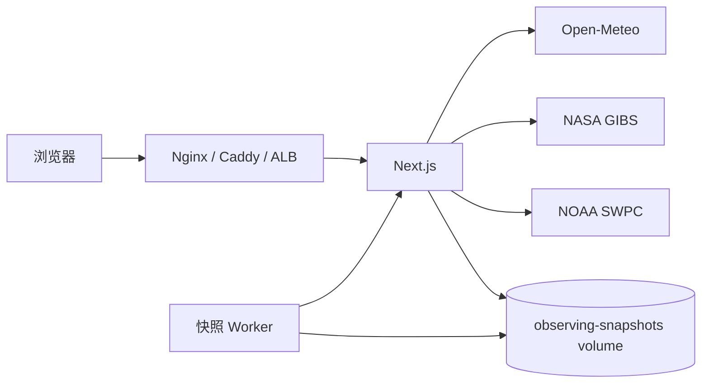

# 逐星｜星空摄影观测平台

<p align="center">
  <strong>把“今晚能不能拍、去哪里拍、几点拍”放进同一套地图与摄影决策工作流。</strong>
</p>

<p align="center">
  <a href="https://github.com/Jovifei/Star_photo_addr/actions/workflows/ci.yml">
    
  </a>
  
  
  
</p>

**逐星**是一套面向星空摄影、暗夜选址、火烧云与高山云海的中文摄影决策平台。它把逐小时天气、卫星云观测、夜光/光污染参考、候选地点筛选、天文位置与特殊天象条件指数放在同一产品中，减少在多个天气网站、地图和表格之间反复切换。

产品当前由四个核心工作区构成：

| 工作区 | 入口 | 主要回答的问题 |
| --- | --- | --- |
| **今夜观测** | `/` | 今晚云量怎样、卫星云带在哪、哪些地点更值得去、几点更适合拍？ |
| **暗夜选址** | `/sites → /` | 哪些地点远离城市夜光、暗夜条件更好、如何把地点加入候选比较？ |
| **火烧云** | `/fireglow` | 日出/日落附近的云层与通光条件指数如何、哪个地点和时次更值得守候？ |
| **高山云海** | `/cloudsea` | 当前 surface cloud、2m 湿度、风和地形条件是否支持云海摄影，以及山峰与启发式云层位置关系如何？ |

原独立「观星计划」已经退役。逐小时天气、日月/银河轨迹、多夜候选比较和高空云层剖面等能力已经整合进统一工作台；历史 `/planner` 链接只作为兼容入口，将地点、模型和时次上下文带回首页。


> [!IMPORTANT]
> 本项目提供的是摄影与观测规划参考，不替代现场天气预警、道路安全、雷电、地质灾害、景区管制或专业天文台判断。

---

## 界面预览

截图由项目生产构建通过 Playwright 自动生成；截图数据用于展示交互与信息结构，不代表当前实时观测结论。

### 今夜观测

<p align="center">
  
</p>

同一工作台内可以查看：

- 当前选择地点与海拔；
- NASA GIBS 卫星云观测、Open-Meteo 数值云量、VIIRS 夜光参考；
- 总云量、高云、中云、低云与逐小时天气；
- 未来 72 小时预报时次与卫星观测时次；
- 候选地点 7 天动态排行；
- 地点详情中的连续观测窗口、月相、暗夜时长、银河高度、小时矩阵与图表；
- 数据源健康状态、缓存/降级状态与人工刷新入口。

### 暗夜选址

<p align="center">
  
</p>

暗夜选址强调“地点是否值得去”，主要结合：

- VIIRS 夜光视觉参考；
- 可选、来源与许可可核验的 Bortle/SQM 本地栅格；
- 天气与云量；
- 观测评分分档；
- 地图取点、目录参考 B1–B4 筛选和候选清单；
- 与首页统一共享的地点、模型、观测夜和时次上下文。

目录参考 B1–B4 仅用于点位库筛选与着色，不是当前栅格或现场 SQM 实测，也不进入实时天气推荐分。

### 移动端

<p align="center">
  
</p>

移动端保留四个核心入口、地图、图层控制、地点详情和单抽屉交互；桌面三列工作台在窄屏下转换为适合触控的侧边栏/底部抽屉结构。

---

## 科学语义与显示边界

### 天气与卫星不是同一时间域

- **卫星云图**：描述已经发生的云况；
- **数值天气/云量**：描述模型对未来的预测；
- **VIIRS 夜光**：长期/年度夜光参考，不是实时光污染；
- **Bortle/SQM**：只有安装授权本地资产后才展示，不从普通夜光瓦片伪造。

### 火烧云

火烧云页面展示的是 **0–100 条件指数**，不是经过实拍样本校准的统计事件概率。指数综合高/中/低云、降水、能见度、阵风以及太阳高度阶段，用来比较地点和时次的相对条件。

### 高山云海 Beta

当前云海工作区同样展示 **0–100 条件指数**。当前 Beta 主要使用 Open-Meteo surface cloud、真实 `relative_humidity_2m`、温度、风、降水、能见度与站点地形进行启发式判断。

云底、云顶和峰顶相对云层位置仍属于启发式估算；页面不会把这些值描述成经过现场探空或实拍校准的概率，也不会在上游关键字段缺失时用固定值补齐。项目已经具备 `/api/pressure-forecast` 压力层数据通道，但当前云海 Beta 不宣称已经完成逆温识别或基于压力剖面的概率校准。

---

## 快速开始

### 环境要求

- Node.js `>= 24`
- npm
- 可选：Docker 与 Docker Compose
- E2E：Playwright 浏览器

### 本地开发

```bash
git clone https://github.com/Jovifei/Star_photo_addr.git
cd Star_photo_addr
npm ci
npm run dev
```

Next.js 默认监听 `3000`。若统一使用 `3100`：

```bash
PORT=3100 npm run dev
```

PowerShell：

```powershell
$env:PORT = "3100"
npm run dev
```

### 生产构建

```bash
npm ci
npm run build
PORT=3100 npm run start
```

### Docker Compose

```bash
cp .env.example .env
export BUILD_REVISION="$(git rev-parse --short=12 HEAD)"
docker compose up --build -d
curl -fsS http://127.0.0.1:3100/healthz
```

PowerShell：

```powershell
Copy-Item .env.example .env
$env:BUILD_REVISION = (git rev-parse --short=12 HEAD)
docker compose up --build -d
Invoke-RestMethod http://127.0.0.1:3100/healthz
```

Compose 默认包含：

- `star-weather`：Next.js 主服务；
- `star-weather-worker`：定时生成观测地点评分快照；
- `observing-snapshots`：持久化快照 named volume。

---

# 使用指南

## 1. 今夜观测 `/`

地点可以来自搜索、地图点击、内置候选或分享链接。统一状态会保留：

- 纬度、经度与地点名称；
- 海拔；
- 天气模型；
- 当前预报/卫星时次；
- 候选地点。

示例深链：

```text
/?lat=30.4694&lng=119.5978&name=天荒坪&elevation=958.4&model=gfs&view=combined&overlay=forecast-cloud
```

主图层：

| 图层 | 含义 | 时间域 |
| --- | --- | --- |
| **卫星云图** | NASA GIBS Himawari AHI Band 13 实际观测 | 已发生的卫星时次 |
| **综合决策** | Open-Meteo 数值天气与云量 | 当前至未来 72 小时 |
| **光污染** | VIIRS 夜光视觉参考与可选暗夜栅格 | 静态/周期参考 |

云量数值表示天空覆盖比例，例如 `70%` 是模型估计约七成天空被对应云层覆盖，**不是“70% 概率有云”**。

人工刷新使用 `no-store`，同时仍受服务端超时、并发合并与强制刷新冷却保护。上游失败时，只允许明确标记的同请求旧缓存继续展示，不使用跨地点缓存或固定值冒充成功。

## 2. 暗夜选址 `/sites`

`/sites` 是兼容入口，最终进入首页统一地图的暗夜选址状态，并尽量保留地点、模型、观测夜和时次。

推荐流程：

1. 进入暗夜选址；
2. 查看 VIIRS 夜光参考与目录参考 B1–B4 地点筛选；
3. 缩放到计划活动区域；
4. 点击地点查看详情和天气；
5. 把值得比较的地点加入候选；
6. 在统一首页的候选排行、地点详情和逐小时矩阵中完成决策。

默认 VIIRS 2023 图层只适合做城市亮区/暗区的视觉参考。它不是实时光污染、不是现场 SQM，也不能直接精确换算为 Bortle。

## 3. 历史 `/planner` 兼容链接

独立 Planner 已退役。访问：

```text
/planner?lat=30.4694&lon=119.5978&name=天荒坪&model=gfs
```

会将可识别的地点和模型参数带回统一首页。生产代码不再维护第二套 Planner UI、评分逻辑或样式；所有最终决策都应在当前统一工作台完成。

## 4. 火烧云 `/fireglow`

- 支持朝霞/晚霞和日期切换；
- 地图与排行显示条件指数，而非校准概率；
- 详情显示日出/日落方位、暮光时序和高/中/低云；
- 强制刷新受冷却保护；上游失败时只回退到有效且未超龄的最近成功快照。

## 5. 高山云海 `/cloudsea`

- 显示晨间/傍晚条件指数；
- 使用真实相对湿度与 surface weather；
- 关键字段缺失时显示数据不足；
- 云底/云顶/峰顶相对层位明确标注为 Beta 启发式估算；
- stale 与 refresh error 在界面可见。

---

# 数据源

| 数据 | 来源 | 用途 | 边界 |
| --- | --- | --- | --- |
| 逐小时天气与云量 | Open-Meteo | 温湿度、露点、降水、风、能见度、总/低/中/高云 | 数值预报，不是卫星实况 |
| 压力层剖面 | Open-Meteo | 高空气压层云量、RH、温度与位势高度 | 需足够压力层才返回可靠剖面 |
| 卫星云图 | NASA GIBS Himawari AHI Band 13 | 观察已发生的云带 | 不是未来预报 |
| 夜光视觉参考 | VIIRS 2023 WMTS | 人工夜光空间分布 | 不等于 Bortle/SQM 实测 |
| 本地暗夜栅格 | 用户提供授权资产 | 可选 Bortle/SQM | 未安装时不造值 |
| 天文位置 | Astronomy Engine | 太阳/月亮高度、月相、银河相关计算 | 仍需考虑地形遮挡 |
| 空气质量 | Open-Meteo | 透明度/气溶胶辅助参考 | 区域模型，不是现场仪器 |
| 空间天气 | NOAA SWPC | 行星 Kp 趋势 | 不等于当地极光概率 |
| 地理编码 | Open-Meteo Geocoding | 搜索与坐标解析 | 同名地点需人工确认 |

---

# 缓存、刷新与容错

默认参数来自 `.env.example`。

| 数据 | 新鲜缓存 | 允许回退的旧缓存 | 强刷冷却 |
| --- | ---: | ---: | ---: |
| 天气预报 | 10 分钟 | 6 小时 | 1 分钟 |
| NASA GIBS 目录 | 15 分钟 | 24 小时 | 1 分钟 |
| 观测点评分快照 | 30 分钟 | 6 小时 | 1 分钟 |
| 数据源健康状态 | 5 分钟 | — | 1 分钟 |

服务端还包含请求超时、同资源并发合并、地点数量上限、错误脱敏、请求中止与新请求覆盖旧请求的竞态保护。

---

# 同源 API

浏览器主要访问项目自己的 Next.js API：

| 接口 | 用途 |
| --- | --- |
| `GET /healthz` | 应用进程存活与构建版本 |
| `GET /api/forecast` | 地点逐小时天气与云量 |
| `GET /api/pressure-forecast` | 压力层云量与垂直剖面 |
| `GET /api/geocode` | 地点搜索 |
| `GET /api/air-quality` | 空气质量 |
| `GET /api/satellite/times` | 卫星云图/夜光时次 |
| `GET /api/space-weather/kp` | NOAA Kp |
| `GET /api/observing/snapshot` | 观星地点评分快照 |
| `GET /api/fireglow/snapshot` | 火烧云条件指数快照 |
| `GET /api/cloudsea/snapshot` | 云海条件指数快照 |
| `GET /api/data-status` | 推荐的运行时数据源诊断 |
| `GET /api/data-sources/health` | 向后兼容的数据源诊断 |

`/healthz` 故意不依赖 Open-Meteo 或 NASA；第三方短时故障不应触发容器健康检查反复重启正常应用。

---

# 配置

```bash
cp .env.example .env.local
```

常用变量：

```dotenv
APP_BIND=127.0.0.1
APP_PORT=3100
APP_IMAGE=star-photo-addr:local
BUILD_REVISION=local

NEXT_PUBLIC_TIANDITU_TOKEN=
NEXT_PUBLIC_LIGHT_POLLUTION_TILE_URL=
NEXT_PUBLIC_ASSET_VIIRS_TILES=false
NEXT_PUBLIC_ASSET_WORLD_ATLAS=false
NEXT_PUBLIC_ASSET_CITY_CANDIDATES=false
NEXT_PUBLIC_ASSET_BOUNDARIES=false

OPEN_METEO_FORECAST_URL=https://api.open-meteo.com/v1/forecast
OPEN_METEO_GEOCODE_URL=https://geocoding-api.open-meteo.com/v1/search
OPEN_METEO_AIR_QUALITY_URL=https://air-quality-api.open-meteo.com/v1/air-quality
GIBS_CAPABILITIES_URL=https://gibs.earthdata.nasa.gov/wmts/epsg3857/best/1.0.0/WMTSCapabilities.xml
NOAA_KP_URL=https://services.swpc.noaa.gov/products/noaa-planetary-k-index-forecast.json
```

> [!NOTE]
> `NEXT_PUBLIC_*` 会在 `next build` 时嵌入浏览器包，修改后必须重新构建镜像。

完整配置见 [`.env.example`](.env.example)。

---

# 部署

推荐只把 `80/443` 暴露到公网，Next.js `3100` 绑定本机或容器网络，由 Nginx/Caddy/ALB 终止 HTTPS。



完整步骤见 [`docs/ALIYUN_DEPLOYMENT.md`](docs/ALIYUN_DEPLOYMENT.md)。发布后建议：

```bash
npm run check:data-sources -- http://127.0.0.1:3100
```

---

# 验证与质量门禁

```bash
npm run lint
npm run typecheck
npm run test:unit
npm run test:contract
npm run test:integration
npm run build
npm run test:e2e
npm run test:e2e:cross-browser
npm run test:live
npm run check
npm run check:full
```

| 命令 | 内容 |
| --- | --- |
| `npm run check` | ESLint + TypeScript + unit/contract/integration + production build |
| `npm run test:e2e` | Chromium desktop/mobile production E2E |
| `npm run test:e2e:cross-browser` | Firefox/WebKit core smoke |
| `npm run test:live` | 真实天气、卫星、AQI、Kp、地理编码上游冒烟 |
| `npm run check:data-sources` | 检查已部署站点的数据源链路 |

GitHub Actions 发布门禁还包含 production dependency audit、Docker Compose/Nginx/production image smoke。

---

# 技术架构

主要技术：

- Next.js 16 App Router；
- React 19 + TypeScript；
- Leaflet / React-Leaflet；
- ECharts；
- Astronomy Engine；
- Vitest；
- Playwright；
- Docker Compose。

```text
Star_photo_addr/
├─ src/
│  ├─ app/                     # 页面、兼容路由与同源 API
│  ├─ components/              # 统一工作台、地点与共享 UI
│  ├─ data/                    # 静态地点数据
│  └─ lib/                     # 天气、压力层、天文、卫星、评分、缓存与诊断
├─ public/
├─ scripts/
│  ├─ live-smoke.mjs
│  ├─ check-data-sources.mjs
│  └─ observing-snapshot-worker.mjs
├─ tests/
│  ├─ unit/
│  ├─ contract/
│  ├─ integration/
│  └─ e2e/
├─ docs/
│  ├─ engineering-change-log/
│  ├─ ALIYUN_DEPLOYMENT.md
│  └─ UNIFIED_VISUAL_SYSTEM.md
├─ Dockerfile
├─ docker-compose.yml
└─ .env.example
```

---

# 常见问题

## 为什么卫星云图和预报云量不一致？

卫星云图是已经发生的观测，数值云量是模型预报；时间、空间分辨率、云层定义和处理方式都不同。正确用法是用卫星确认当前云带，再用预报判断后续变化。

## 为什么没有显示 Bortle 或 SQM？

项目不会把普通夜光图层直接伪装成现场 Bortle/SQM。只有安装并启用来源与许可可核验的本地栅格后才显示。

## 为什么刷新后仍显示缓存？

服务端可能处于强制刷新冷却窗口，或在上游失败时回退到明确标记的同请求旧数据。缓存来源、stale 和刷新错误会在相应状态区域展示。

## `/planner` 为什么回到首页？

独立 Planner 已退役；这是有意的兼容行为。历史链接中的地点/模型上下文会尽量保留，最终决策功能已经整合进首页和地点详情。

## 地图推荐地点是否代表道路安全？

不是。推荐只用于摄影规划，不代表道路开放、车辆可达、景区许可或现场安全。

---

# 文档与变更记录

- [阿里云部署手册](docs/ALIYUN_DEPLOYMENT.md)
- [统一视觉系统](docs/UNIFIED_VISUAL_SYSTEM.md)
- [工程修改跟踪目录](docs/engineering-change-log/)
- [产品与技术计划](docs/PRODUCT_TECH_PLAN.md)
- [参考站审计](docs/PERSEIDS_REFERENCE_AUDIT.md)

较大功能、Bug 修复或部署变更继续按下面结构记录：

```text
修改目的 → 现象 → 根因 → 修复 → 验证 → 风险与回滚
```

---

# 许可

项目 `package.json` 声明为 MIT License。第三方天气、卫星、地图和暗夜资产分别受各数据提供方条款约束；自建部署者应自行确认生产使用、缓存、再分发和署名要求。
