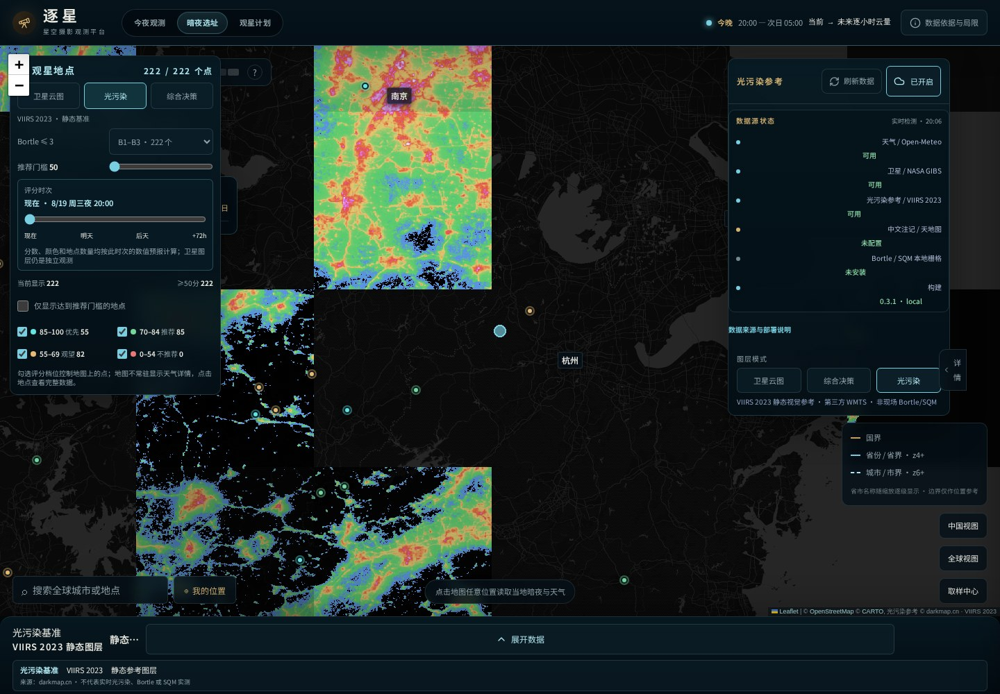
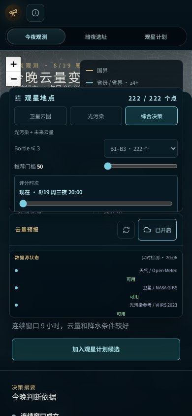
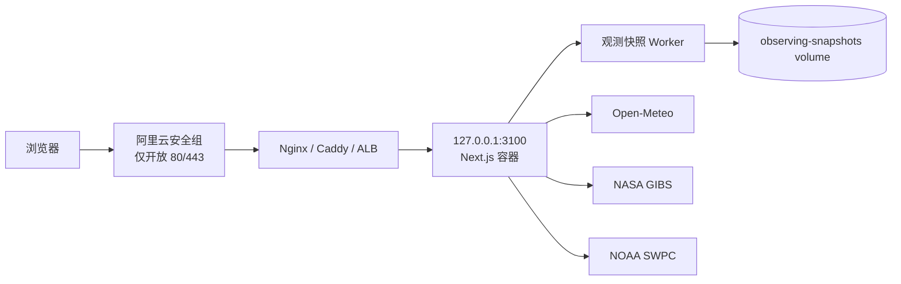
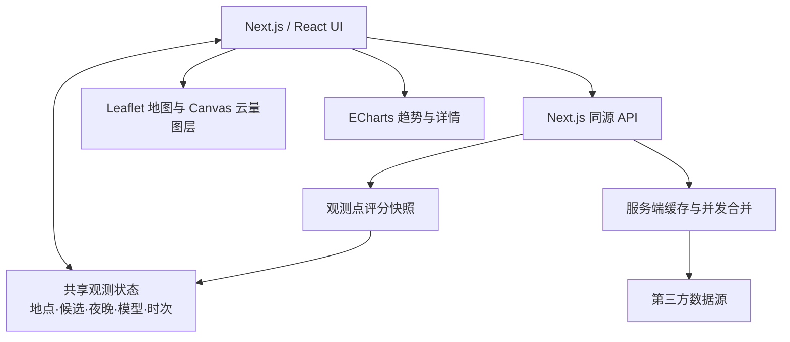

# 逐星｜星空摄影观测平台

<p align="center">
  <strong>把“今晚能不能拍、去哪里拍、几点拍”放进同一套地图与计划工作流。</strong>
</p>

<p align="center">
  <a href="https://github.com/Jovifei/Star_photo_addr/actions/workflows/ci.yml">
    
  </a>
  
  
  
</p>

**逐星**是一套面向星空摄影、流星雨观测和暗夜选址的中文决策平台。它把未来逐小时天气、卫星云观测、夜光/光污染参考、观星地点筛选和多夜计划放在同一个产品中，避免在多个天气网站、地图和表格之间反复切换。

产品由三个连续工作区构成：

| 工作区 | 路由 | 主要问题 |
| --- | --- | --- |
| **今夜观测** | `/` | 今晚云量如何、卫星云图怎样、哪个时次更适合拍摄？ |
| **暗夜选址** | `/sites` | 哪些地点远离城市夜光、天气条件更合适、值得加入候选？ |
| **观星计划** | `/planner` | 多个地点和未来 1/3/5/7 夜之间，最终选哪一天、哪个地点、哪个连续窗口？ |

三个工作区共享地点、候选清单、观测夜、天气模型、预报时次、卫星时次和图层状态，形成完整闭环：


> [!IMPORTANT]
> 本项目提供的是摄影与观测规划参考，不替代现场天气预警、道路安全、雷电、地质灾害、景区管制或专业天文台判断。

---

## 界面预览

以下截图由当前生产构建通过 Playwright 自动生成。截图中的数据用于展示交互与信息结构，不代表你打开页面时的实时观测结论。

### 今夜观测：地图、云量、时次与数据源状态

<p align="center">
  
</p>

在同一张地图中查看：

- 当前选择地点与海拔；
- 卫星云观测、数值云量预报、光污染参考三种图层；
- 总云量、高云、中云、低云；
- 未来 72 小时预报时次；
- 当前数据源状态、缓存状态与刷新入口；
- 观星地点评分和候选地点。

### 暗夜选址：光污染、评分分档与候选地点

<p align="center">
  
</p>

暗夜选址强调“地点是否值得去”，主要结合：

- VIIRS 夜光视觉参考；
- 可选的授权 Bortle/SQM 本地栅格；
- 天气和云量；
- 观测评分分档；
- 地图取点与候选清单；
- 跳转观星计划时的上下文继承。

### 观星计划：多地点、多夜晚和连续观测窗口

<p align="center">
  
</p>

观星计划用于最终决策：

- 比较未来 1/3/5/7 夜；
- 查看地点排行与评分；
- 检查云量、降水、风、月光和连续可用窗口；
- 在详情抽屉中切换夜晚和小时；
- 保留当前地点、模型与时次并返回地图复核。

### 移动端

<p align="center">
  
</p>

移动端保留三个工作区导航、地图、图层控制、地点详情和底部抽屉。桌面侧栏会在窄屏下转换为更适合触控的布局。

---

## 适合什么场景

- 银河、星轨、流星雨、深空广角等夜间摄影前的地点与天气规划；
- 出发前检查未来逐小时云量，而不是只看一张“晴/阴”图标；
- 对照卫星实况与数值预报，判断云带是否正在接近；
- 在城市周边寻找夜光更少的候选机位；
- 比较多个地点未来几夜的连续拍摄窗口；
- 将观测计划部署到个人服务器，作为长期使用的自托管工具。

---

## 快速开始

### 环境要求

- Node.js `>= 24`
- npm
- 可选：Docker 与 Docker Compose
- E2E/截图：Chromium（Playwright 可自动安装）

### 方式一：本地开发

```bash
git clone https://github.com/Jovifei/Star_photo_addr.git
cd Star_photo_addr
npm ci
npm run dev
```

Next.js 默认监听 `http://localhost:3000`。

项目统一使用 `3100` 端口时：

**Linux / macOS / Git Bash**

```bash
PORT=3100 npm run dev
```

**Windows PowerShell**

```powershell
$env:PORT = "3100"
npm run dev
```

然后打开：

```text
http://127.0.0.1:3100
```

### 方式二：生产构建

```bash
npm ci
npm run build
PORT=3100 npm run start
```

### 方式三：Docker Compose

```bash
cp .env.example .env
export BUILD_REVISION="$(git rev-parse --short=12 HEAD)"
docker compose up --build -d
curl -fsS http://127.0.0.1:3100/healthz
```

Windows PowerShell：

```powershell
Copy-Item .env.example .env
$env:BUILD_REVISION = (git rev-parse --short=12 HEAD)
docker compose up --build -d
Invoke-RestMethod http://127.0.0.1:3100/healthz
```

Docker Compose 默认启动：

- `star-weather`：Next.js 主服务；
- `star-weather-worker`：定时生成观测地点评分快照；
- `observing-snapshots`：保存快照的 named volume。

---

# 使用指南

## 1. 今夜观测

入口：

```text
/
```

### 第一步：选择地点

可以通过搜索、地图点击或推荐地点标记选择位置。地点状态会保存：

- 纬度、经度；
- 地点名称；
- 海拔；
- 当前天气模型；
- 当前预报/卫星时次；
- 已加入的观星计划候选。

也可以直接用 URL 分享一个观测上下文：

```text
/?lat=30.4694&lng=119.5978&name=天荒坪&elevation=958.4&model=gfs&view=combined&overlay=forecast-cloud
```

### 第二步：选择图层

页面提供三类互斥主图层：

| 图层 | 含义 | 时间域 |
| --- | --- | --- |
| **卫星云图** | NASA GIBS Himawari AHI Band 13 实际观测 | 过去一段时间的卫星时次 |
| **综合决策** | Open-Meteo 数值天气与云量网格 | 当前至未来 72 小时 |
| **光污染** | VIIRS 夜光视觉参考和可选暗夜栅格 | 静态/周期性参考 |

不要把卫星观测时间和天气预报时间混为一谈：前者描述已经发生的云况，后者描述模型预测的未来云况。

### 第三步：阅读云量

数值预报支持：

- **总云量**：整个天空被云覆盖的比例；
- **低云**：通常更直接影响地面观测；
- **中云**；
- **高云**：薄云也可能降低星点对比度。

数值含义是天空覆盖百分比，例如 `70%` 表示模型估计约七成天空被对应云层覆盖，并不代表“70% 的概率会有云”。

### 第四步：切换时次

时间轴用于查看未来小时变化。选择小时后会同步：

- 云量图层；
- 当前地点读数；
- 地图上的观星评分；
- 推荐地点数量和筛选基准。

### 第五步：检查数据源状态

“数据源状态”区域会显示：

- Open-Meteo 天气；
- NASA GIBS 卫星；
- VIIRS 光污染参考；
- 天地图中文注记；
- 本地 Bortle/SQM 资产；
- 当前构建版本。

状态可能为：

| 状态 | 含义 |
| --- | --- |
| `available` | 当前可用 |
| `degraded` | 可返回部分结果，或正在使用降级来源 |
| `unconfigured` / `not-installed` | 可选数据没有配置，不是假装成功 |
| `error` | 当前探测失败 |

### 第六步：刷新

点击“刷新数据”会重新请求：

- 当前地点天气；
- 云量采样网格；
- 观星地点评分快照；
- 卫星时次目录；
- 数据源健康状态。

刷新请求使用 `no-store`，同时仍受服务端超时、并发合并和强制刷新冷却保护。上游临时失败时，界面只会使用明确标记为旧数据的缓存，不会用空数组或固定值冒充成功。

---

## 2. 暗夜选址

入口：

```text
/sites
```

`/sites` 是兼容入口，最终进入统一地图中的暗夜选址工作区，并保留原有地点、模型、观测夜和时次。

### 推荐流程

1. 切换到“光污染”图层；
2. 缩放到计划活动的区域；
3. 使用评分分档筛选地点；
4. 点击标记查看地点信息；
5. 将有价值的地点加入观星计划候选；
6. 前往 `/planner` 比较多个地点。

### 光污染数据边界

默认的 VIIRS 2023 图层用于观察人工夜光空间分布，适合做“城市亮区/暗区”的视觉参考，但它：

- 不是实时光污染；
- 不是现场实测 SQM；
- 不能直接、精确地换算为 Bortle 等级；
- 可能受到数据年份、地表反射、积雪、云和成像处理影响。

只有在你取得来源和许可均可核验的本地栅格，并显式设置 `NEXT_PUBLIC_ASSET_*` 后，系统才会展示对应 Bortle/SQM 信息；未安装时明确显示无数据。

---

## 3. 观星计划

入口：

```text
/planner
```

推荐从地图把地点加入候选后进入，这样地点、海拔、模型和观测上下文会自动继承。

### 页面组成

- **主地点卡片**：当前优先地点、评分和最佳窗口；
- **夜晚切换**：今晚以及未来几夜；
- **地点排行**：候选地点横向比较；
- **多地点矩阵**：同一夜晚下比较不同地点；
- **详情抽屉**：逐小时天气、云量、风、降水和月光；
- **1/3/5/7 夜趋势**：查看稳定性，而不是只依赖某一个小时。

### 如何做最终决策

建议按以下顺序判断：

1. 是否存在明确阻断项，例如降水或极高云量；
2. 是否有足够长的连续窗口；
3. 月亮高度和月相是否影响拍摄主题；
4. 风速、阵风、湿度和露点差是否适合设备；
5. 地点之间的交通、安全和现场条件；
6. 临出发前再回到“今夜观测”复核卫星云图。

---

# 数据源与科学语义

| 数据 | 来源 | 在产品中的用途 | 重要边界 |
| --- | --- | --- | --- |
| 逐小时天气与云量 | Open-Meteo | 温度、湿度、露点、降水、风、能见度、总/低/中/高云量 | 数值模式预报，不是卫星实况 |
| 卫星云图 | NASA GIBS Himawari AHI Band 13 | 观察已经发生的云带分布与变化 | 不是未来预报 |
| 夜光视觉参考 | VIIRS 2023 WMTS | 查看人工夜光空间分布 | 不等于 Bortle/SQM 实测 |
| 本地暗夜栅格 | 用户提供的授权资产 | 可选 Bortle/SQM 或暗夜等级 | 未安装时不生成虚假值 |
| 天文位置 | Astronomy Engine | 太阳/月亮高度、月相、银河核心等 | 计算结果仍需结合地形遮挡 |
| 空气质量 | Open-Meteo CAMS | 辅助判断透明度与气溶胶风险 | 区域模型，不是现场仪器 |
| 空间天气 | NOAA SWPC Kp | 展示全球行星 Kp 趋势 | 不等于当地极光概率 |
| 地理编码 | Open-Meteo Geocoding | 地点搜索与坐标解析 | 名称可能存在同名和行政区差异 |

---

# 缓存、刷新与容错

默认参数来自 `.env.example`，均可按服务器资源和上游配额调整。

| 数据 | 新鲜缓存 | 允许回退的旧缓存 | 强制刷新冷却 |
| --- | ---: | ---: | ---: |
| 天气预报 | 10 分钟 | 6 小时 | 1 分钟 |
| NASA GIBS 目录 | 15 分钟 | 24 小时 | 1 分钟 |
| 观测点评分快照 | 30 分钟 | 6 小时 | 1 分钟 |
| 数据源健康状态 | 5 分钟 | — | 1 分钟 |

服务端还包含：

- 请求超时；
- 同一资源的并发请求合并；
- 地点数量上限；
- 上游错误脱敏；
- 用户取消与组件卸载时的请求中止；
- 新请求覆盖旧请求的竞态保护。

---

# 同源 API

浏览器主要访问项目自己的 Next.js API，避免前端散落第三方请求逻辑。

| 接口 | 用途 |
| --- | --- |
| `GET /healthz` | 仅检查应用进程是否存活 |
| `GET /api/forecast` | 地点逐小时天气与云量 |
| `GET /api/pressure-forecast` | 气压层云量和垂直剖面 |
| `GET /api/geocode` | 地点搜索 |
| `GET /api/air-quality` | 空气质量 |
| `GET /api/satellite/times` | 卫星云图/夜光可用时次 |
| `GET /api/space-weather/kp` | NOAA Kp |
| `GET /api/observing/snapshot` | 观星地点评分快照 |
| `GET /api/data-status` | 推荐的运行时数据源诊断入口 |
| `GET /api/data-sources/health` | 向后兼容的数据源诊断入口 |

示例：

```bash
curl -fsS http://127.0.0.1:3100/healthz

curl -fsS \
  'http://127.0.0.1:3100/api/forecast?latitude=30.4694&longitude=119.5978&days=3&model=gfs'

curl -fsS http://127.0.0.1:3100/api/data-status

curl -fsS \
  'http://127.0.0.1:3100/api/data-status?refresh=1'
```

`/healthz` 故意不依赖 Open-Meteo 或 NASA。第三方上游短时故障不应导致 Docker、SLB 或 ALB 不停重启正常的应用容器。

---

# 配置

复制模板：

```bash
cp .env.example .env.local
```

Windows PowerShell：

```powershell
Copy-Item .env.example .env.local
```

## 常用变量

### 端口与镜像

```dotenv
APP_BIND=127.0.0.1
APP_PORT=3100
APP_IMAGE=star-photo-addr:local
BUILD_REVISION=local
```

### 中文地图与暗夜资产

```dotenv
NEXT_PUBLIC_TIANDITU_TOKEN=
NEXT_PUBLIC_LIGHT_POLLUTION_TILE_URL=

NEXT_PUBLIC_ASSET_VIIRS_TILES=false
NEXT_PUBLIC_ASSET_WORLD_ATLAS=false
NEXT_PUBLIC_ASSET_CITY_CANDIDATES=false
NEXT_PUBLIC_ASSET_BOUNDARIES=false
```

### 上游地址

```dotenv
OPEN_METEO_FORECAST_URL=https://api.open-meteo.com/v1/forecast
OPEN_METEO_GEOCODE_URL=https://geocoding-api.open-meteo.com/v1/search
OPEN_METEO_AIR_QUALITY_URL=https://air-quality-api.open-meteo.com/v1/air-quality
GIBS_CAPABILITIES_URL=https://gibs.earthdata.nasa.gov/wmts/epsg3857/best/1.0.0/WMTSCapabilities.xml
NOAA_KP_URL=https://services.swpc.noaa.gov/products/noaa-planetary-k-index-forecast.json
```

> [!NOTE]
> `NEXT_PUBLIC_*` 会在 `next build` 时嵌入浏览器包。修改这些变量后必须重新构建镜像，单纯重启容器不会生效。

完整配置项及默认值见 [`.env.example`](.env.example)。

---

# 阿里云部署

推荐结构：



部署原则：

- `3100` 只监听 `127.0.0.1`；
- 公网仅开放 `80/443`；
- 使用 Nginx/Caddy/ALB 终止 HTTPS；
- `/healthz` 用于容器或负载均衡存活检查；
- `/api/data-status` 用于第三方数据源诊断；
- 快照 volume 独立于镜像；
- 发布后运行数据源冒烟脚本。

完整步骤：

- [`docs/ALIYUN_DEPLOYMENT.md`](docs/ALIYUN_DEPLOYMENT.md)

发布后检查：

```bash
npm run check:data-sources -- http://127.0.0.1:3100
```

或者：

```bash
node scripts/check-data-sources.mjs https://你的域名
```

---

# 验证与质量门禁

```bash
npm run lint
npm run typecheck
npm run test:unit
npm run build
npm run test:e2e
npm run test:live
npm run check
npm run check:full
```

| 命令 | 内容 |
| --- | --- |
| `npm run check` | ESLint + TypeScript + Unit + Production Build |
| `npm run test:e2e` | Chromium desktop/mobile 生产模式流程 |
| `npm run test:live` | 真实 Open-Meteo、NASA GIBS、AQI、Kp、地理编码冒烟 |
| `npm run check:data-sources` | 检查已部署站点的数据源链路 |
| `npm run check:full` | `check` + E2E |

首次运行浏览器测试：

```bash
npx playwright install chromium
```

---

# 技术架构



主要技术：

- Next.js 16 App Router；
- React 19；
- TypeScript；
- Leaflet / React-Leaflet；
- ECharts；
- Astronomy Engine；
- Vitest；
- Playwright；
- Docker Compose。

---

# 目录结构

```text
Star_photo_addr/
├─ src/
│  ├─ app/                     # 页面路由、布局和同源 API
│  ├─ components/              # 今夜观测、暗夜选址和共享 UI
│  ├─ features/planner/        # 观星计划
│  ├─ lib/                     # 天气、云量、卫星、评分、缓存与诊断
│  └─ data/                    # 地点与静态数据
├─ public/
│  ├─ images/perseids/         # 可选授权暗夜资产
│  └─ sites/                   # 观测地点静态资源
├─ scripts/
│  ├─ live-smoke.mjs           # 真实第三方源冒烟
│  ├─ check-data-sources.mjs   # 已部署站点检查
│  └─ observing-snapshot-worker.mjs
├─ tests/
│  ├─ unit/
│  ├─ planner/
│  └─ e2e/
├─ docs/
│  ├─ engineering-change-log/  # 工程修改目的、Bug、修复与回滚记录
│  ├─ ALIYUN_DEPLOYMENT.md
│  └─ UNIFIED_VISUAL_SYSTEM.md
├─ Dockerfile
├─ docker-compose.yml
└─ .env.example
```

---

# 常见问题

## 为什么卫星云图和预报云量看起来不一致？

卫星云图是已经发生的观测，数值云量是未来模型预报。两者的时间、分辨率、云层定义和处理方式都不同。正确用法是用卫星图判断当前云带，再用预报判断后续变化。

## 为什么没有显示 Bortle 或 SQM？

项目不会把普通夜光图层直接伪装成现场 Bortle/SQM。只有安装并启用来源和许可可核验的本地栅格后才显示。

## 为什么点击刷新后仍显示“缓存”？

服务端可能在强制刷新冷却窗口内合并重复请求，或者在上游失败时回退到明确标记的旧数据。状态区域会区分实时检测、缓存检测、合并检测和刷新冷却。

## 为什么本地 `npm run dev` 打开的是 3000 端口？

`next dev` 默认端口是 3000。使用 `PORT=3100 npm run dev`，或者在 PowerShell 中先设置 `$env:PORT = "3100"`。

## 地图上的推荐地点是否代表道路安全？

不是。推荐点用于摄影规划参考，不代表道路开放、车辆可达、景区许可或现场安全。出发前必须独立核对。

---

# 文档与变更记录

- [阿里云部署手册](docs/ALIYUN_DEPLOYMENT.md)
- [统一视觉系统](docs/UNIFIED_VISUAL_SYSTEM.md)
- [工程修改跟踪目录](docs/engineering-change-log/)
- [PR #7：统一界面、数据获取刷新与部署加固](docs/engineering-change-log/2026-08-19-pr-7-unified-ui-data-delivery.md)
- [README 图形化使用指南变更记录](docs/engineering-change-log/2026-08-19-readme-visual-guide.md)

较大功能、Bug 修复或部署变更应继续在 `docs/engineering-change-log/` 中记录：

```text
修改目的 → 现象 → 根因 → 修复 → 验证 → 风险与回滚
```

---

# 许可

项目 `package.json` 声明为 MIT License。第三方天气、卫星、地图和暗夜资产仍分别受其数据提供方条款约束；自建部署者应自行确认生产使用、缓存、再分发和署名要求。
