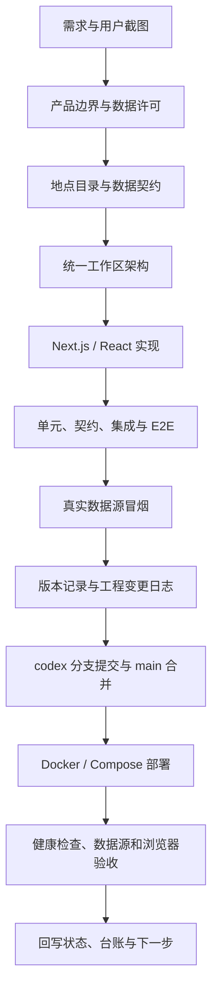

# 逐星项目制造与交付流程

> 文档类型：ARC（Architecture / Release Process）
> 当前版本：v1.0.12（已合并，待部署）
> 当前主线合并提交：`main@d64009276db0dbc55cc1963afbc31587703fbc18`
> 上一发布基线：`main@a66ad049dfd69a87b0f97b5a5870679163260427`（v1.0.11）
> 生产站点：[photo.joviluma.com](https://photo.joviluma.com/)

## 1. 项目要制造什么

《逐星》是面向中文用户的星空摄影决策平台，把“今晚能不能拍、去哪里拍、几点拍”放进同一套地图工作台。产品由以下工作区组成：

| 工作区 | 主要决策 | 主要输入 |
| --- | --- | --- |
| 今夜观测 `/` | 今晚哪些地点、哪些小时值得拍 | Open-Meteo、NASA GIBS、天文计算、地点目录 |
| 暗夜选址 `/sites` | 哪些地点适合长期储备 | VIIRS 视觉夜光、目录参考 B1–B4、海拔、天气复核 |
| 火烧云 `/fireglow` | 日出/日落附近的相对条件 | 高/中/低云、降水、能见度、阵风、太阳高度 |
| 高山云海 `/cloudsea` | 山顶是否可能位于模式低云层之上 | surface 天气、pressure-level profile、地形和太阳事件 |
| 观星计划 `/planner` | 多地点、多夜晚如何比较 | 统一首页兼容跳转、候选列表、7 天排行、逐小时矩阵 |

`/planner` 和 `/sites` 是兼容入口，最终复用统一地图与状态。推荐结果是规划参考，不替代现场天气预警、道路安全、景区管制、雷电或地质灾害判断。

## 2. 制造闭环



### 2.1 需求和边界

先把用户要看的决策和不能承诺的结论写清楚，再开始改代码。当前最重要的边界是：

- 卫星云图是已经发生的观测；数值天气是未来预测，不能互换；
- VIIRS 只表示年度/长期夜光视觉参考，不等于实时光污染；
- 目录 B1–B4 是整理点位的参考元数据，不是现场 SQM/Bortle 测量，也不进入实时天气分；
- 火烧云和云海使用 0–100 条件指数，不包装成长期实拍校准概率；
- 没有授权的暗夜栅格、行政边界或现场仪器数据时，必须显示“未安装/数据不足”，不得补造数值。

### 2.2 数据和地点目录

地点目录由 `src/lib/observingSites.ts`、`src/data/` 和 CloudSea/Fireglow 专用数据组成。新增地点时要：

1. 去重稳定 ID、名称和坐标；
2. 记录来源类别、海拔和保守的目录参考值；
3. 写清银河、晚霞、云海或海岛机位的使用方向与安全提示；
4. 不把公开景区描述升级成概率、暗空真值或道路安全保证；
5. 补齐目录数量、默认候选、单元测试和变更记录。

### 2.3 架构实现

| 层 | 关键位置 | 责任 |
| --- | --- | --- |
| 路由与页面 | `src/app/` | App Router 页面、兼容入口、同源 API |
| 共享工作台 | `src/components/PerseidsApp.tsx`、`workspace/` | 顶栏、命令栏、输入列、地图列、证据列 |
| 交互组件 | `src/components/` | 地图、搜索、候选、图层、推荐、详情和移动抽屉 |
| 状态与契约 | `src/lib/store.tsx`、`src/lib/types.ts` | 地点、模型、时次、候选、偏好和数据状态 |
| 业务算法 | `src/lib/observingSites.ts`、`nighttime.ts`、`scoring.ts` 等 | 时间语义、评分、窗口、排序和数据降级 |
| 数据采集 | `src/app/api/`、`scripts/observing-snapshot-worker.mjs` | Open-Meteo、NASA、NOAA、缓存和快照预热 |
| 发布运行时 | `Dockerfile`、`docker-compose*.yml`、`deploy/nginx/` | 非 root 容器、健康检查、worker、持久卷和反向代理 |

当前 v1.0.12 的顶部命令栏按“评分时间 → B1–B4 → 推荐门槛 → 仅显示推荐地点”排列；B1/B2/B3/B4 分别对应 ≥85/70/55/50 分预设，主页默认云量预报 + 光污染参考，实况需主动选择。火烧云和云海排行各自提供 0–100 分滑块，只显示 `score ≥ threshold` 的地点。桌面 1280/1440 可同排显示，移动端按宽度堆叠。

### 2.4 测试和质量门禁

先跑最小专项测试，再跑全量门禁。建议顺序：

```powershell
npm run lint
npm run typecheck
npm run test
$env:NODE_OPTIONS = "--max-old-space-size=1024"
npm run build
npm run test:e2e
npm run test:live
npm audit --omit=dev --audit-level=high
```

测试分层：

- `tests/unit/`：评分、时间、坐标、排序、缓存和数据语义纯逻辑；
- `tests/contract/`：Open-Meteo、GIBS 等外部响应契约；
- `tests/integration/`：API 参数、状态码、缓存和失败降级；
- `tests/e2e/`：真实生产构建中的 Chromium 桌面/移动操作，主要使用脱敏 fixture；
- `test:live`：发布前真实 Open-Meteo、NASA GIBS、NOAA 和 VIIRS 冒烟；
- 人工/真机：iPhone Safari、Android、多浏览器缩放、色觉/高对比、性能和现场科学校准。

上一版 v1.0.11 已验证：`npm run check` 的 51 个 Vitest 文件 / 302 项测试通过；Chromium E2E 140 个实例中 106 passed、34 skipped、0 failed。v1.0.12 已验证 `npm run check`（52 个 Vitest 文件 / 304 项测试）、Chromium E2E 144 个实例中 110 passed、34 skipped、0 failed、真实数据源冒烟通过和生产依赖 0 vulnerabilities；已合并到主线，生产部署与公网结果待本轮回写。skipped、MANUAL、BLOCKED 不得写成 PASS。

## 3. 版本与交付

每个发布版本至少同步以下内容：

1. `package.json` 与 `package-lock.json` 版本；
2. 根目录 `CHANGELOG.md`；
3. `docs/CHANGELOG.md`；
4. `src/components/ChangelogModal.tsx` 的交互式版本记录；
5. `docs/engineering-change-log/YYYY-MM-DD-*.md`；
6. `docs/project-tracking/PROJECT_STATUS.md`、`CHANGE_LEDGER.md`；
7. `docs/testing/TEST_STATUS.md` 与必要的 `TEST_BACKLOG.md`；
8. `tasks/todo.md` 的计划和 Review 结果。

分支和提交约定：

```text
git switch -c codex/<work-package>-YYYYMMDD
git add <explicit-files>
git commit -m "codex: <concise change>"
git push -u origin codex/<work-package>-YYYYMMDD
git switch main
git pull --ff-only
git merge --no-ff codex/<work-package>-YYYYMMDD -m "codex: merge <work-package>"
git push origin main
```

合并前核对工作区、staged diff、版本号、测试命令和未覆盖边界。不要 reset、强推、删除数据卷或把旧分支的绿灯当作当前主线证据。

## 4. 部署过程

### 4.1 标准 Linux / Compose 流程

在服务器项目目录执行：

```bash
git fetch origin main
git switch main
git pull --ff-only
export BUILD_REVISION="$(git rev-parse --short=12 HEAD)"
docker compose -f docker-compose.yml -f docker-compose.aliyun.yml up -d --build
docker compose -f docker-compose.yml -f docker-compose.aliyun.yml ps
curl -fsS http://127.0.0.1:3100/healthz
curl -fsS http://127.0.0.1:3100/api/data-status
```

域名和 TLS 可用后，再执行：

```bash
npm run check:data-sources -- https://你的域名
curl -fsS https://你的域名/healthz
```

应用监听回环地址，Nginx 负责 HTTPS 反向代理；快照使用命名卷，升级容器不能删除该卷。

### 4.2 ECS 小内存部署经验

2C2G 或 1.8GiB 左右的 ECS 可能在远端完整 `next build` 或 `apk add` 阶段卡住。已验证的低内存路径是：

1. 在本地从已合并的 `main` 构建 standalone，并设置 `NEXT_PUBLIC_BUILD_REVISION` 为当前主线短 SHA；
2. 上传 `.next/standalone/`、`.next/static/`、`public/`、worker 和临时 Dockerfile 到 `/opt/star-photo/.deploy-<sha>/`；
3. 以服务器已有的 `star-photo-addr:local` 镜像为基础，只复制新产物，避免远端下载基础包；
4. 远端用 `docker build --build-arg BUILD_REVISION=<sha>` 构建同名镜像；
5. 更新 `.env` 的 `BUILD_REVISION`，执行 `docker compose ... up -d --no-build --force-recreate star-weather star-weather-worker`；
6. 等待 app 和 worker healthy，检查本机 `/healthz`、`/api/data-status`，再检查公网域名和页面；
7. 验收成功后删除本次明确创建的 `.deploy-<sha>` 临时目录，不触碰 `observing-snapshots` 命名卷。

这个流程只解决构建资源限制，不绕过测试、版本记录、健康检查或数据源真实性门禁。

### 4.3 发布后验收

至少保存以下事实：

| 检查 | 通过条件 |
| --- | --- |
| `docker compose ps` | app 与 worker 均 running/healthy |
| `/healthz` | `status=ok`、应用名正确、版本和 build revision 与 main 一致 |
| `/api/data-status` | weather/satellite/light-pollution 状态明确；未配置项不伪造可用 |
| `check:data-sources` | forecast、卫星、夜光和应用身份检查通过 |
| 页面 | `/`、`/sites`、`/fireglow`、`/cloudsea` 可访问，关键控件可操作 |
| 数据卷 | 观测快照在容器重建后仍存在 |

如果只检查到了 HTTP 200，而没有检查应用身份、版本、数据源状态或 worker，不得报告“部署完成”。

## 5. 回滚与风险

回滚使用已知的上一主线 SHA 或 tag，先确认目标，再执行 `git pull --ff-only` 和同一 Compose 流程。不要使用 `git reset --hard`、`docker compose down -v` 或删除未知目录。回滚后重新检查：

- `/healthz` 的版本和 SHA；
- worker healthy 与快照卷；
- 公网核心页面；
- 数据源 stale/error 语义；
- Nginx/TLS 代理状态。

当前仍保留的能力边界：iPhone/Android 真机、200% 缩放、高对比/色觉、隔离环境压力测试、有许可 Bortle/SQM 栅格和现场科学校准仍需人工或外部条件，不能因自动化 E2E 通过而宣称完成。
