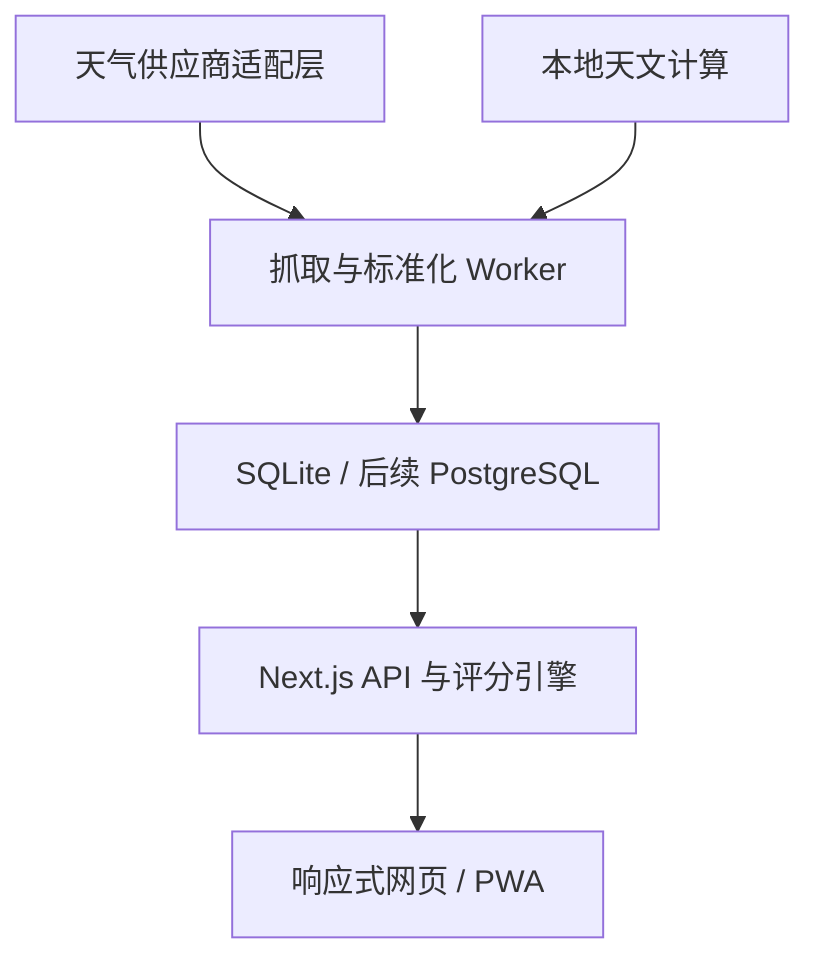
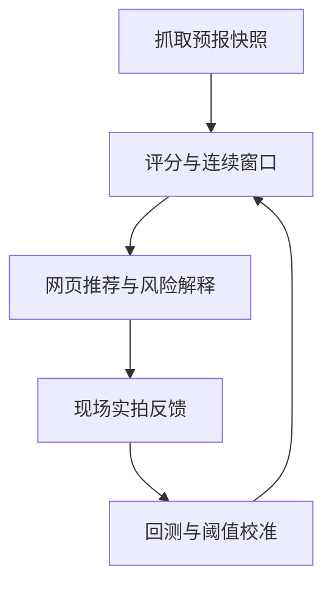

# 星空摄影天气决策网页：整体方案、执行计划与 Codex 执行提示词

> 版本：v0.1（方案基线）  
> 日期：2026-08-05  
> 目标：将参考图片中的“点位表、天文条件、低云海拔评估、核心窗口、最终建议”重构成可长期自动刷新的响应式网页，并建立可验证、可回溯、可逐步校准的预测闭环。

---

## 1. 先给结论

这个产品可以实现，但必须把以下三件事分开，否则会出现“界面看起来很专业，结论却不可信”的问题：

1. **星空/银河可拍性**：核心是云量、降水、透明度、风、天文黑夜、月光干扰和银河位置。
2. **低云/云海潜力**：核心是相机海拔与低云层的相对位置、周边谷地云量、逆温、风和降水。它与“星空可拍”不是同一个分数。
3. **出行安全**：雷暴、大风、降雨、能见度、结冰和数据过期属于硬门禁，不能被其他高分抵消。

推荐第一版采用：

- 个人/非商用 MVP：Open-Meteo 多模型天气 + Astronomy Engine 天文计算 + SQLite 持久化 + Docker 部署。
- 7 天用于近期决策，14 天用于趋势规划；8–14 天不得显示成与 1–3 天同等可靠的“可去/不可去”。
- 点位支持图片中的 12 个预置点，同时支持经纬度新增；领域内部一律保存 WGS84 坐标。
- 推荐结论由**可解释的确定性规则和评分引擎**生成，不让大语言模型决定是否出发。
- 低云云底/云顶来自气压层剖面的推导，必须显示置信度、取整并说明局限，不能展示到个位数米的虚假精度。

### 当前等待用户确认的 3 个决策

| 决策 | 当前默认值 | 为什么重要 |
|---|---|---|
| 使用范围 | 个人非商用 | 决定天气 API 许可、登录和限流方案 |
| 数据预算 | 免费起步、保留付费适配器 | 决定是否接入商业云底/云顶或更强中国区数据 |
| 部署位置 | 先本地 Docker，后迁移 Linux VPS | 决定后台定时任务、HTTPS、域名和备份方式 |

如实际选择不同，Codex 应在 Phase 0 修改技术决策，不得默认忽略。

---

## 2. 从参考图片中复刻的功能

### 2.1 原图已有能力

- 点位表：名称、纬度、经度、海拔。
- 天文条件：观测夜、月相/照度、月亮在地平线上时长、天文暗夜时长、银河最高高度。
- 低云海拔评估：有效小时、通透小时、风险小时、不宜小时、连续窗口、云底/云顶、点位相对云层的位置、建议。
- 核心窗口矩阵：每个点位在每个观测夜的“通透小时 / 有效小时”。
- 综合最优机位。

### 2.2 网页版应保留但升级的能力

- 7 天 / 14 天切换。
- 按夜晚跨日显示，例如“8 月 11 日夜”指当地 8 月 11 日傍晚到 8 月 12 日清晨。
- 点位排名与比较矩阵。
- 点位详情和逐小时曲线。
- 数据更新时间、数据源、预测时效与过期状态。
- 移动端深色界面，桌面端也可用。

### 2.3 必须新增的能力

- “星空模式”和“云海模式”分开评分、分开推荐。
- 逐小时查看总云、低云、中云、高云、降水概率/雨量、湿度、露点差、能见度、风速/阵风。
- 天文黑夜、月亮高度/照度、银河核心高度/方位与可见窗口。
- 预报置信度与模型分歧。
- 绿色可去、黄色候选、红色不建议、灰色无数据/已过期；不能只用颜色表达。
- 硬安全门禁与原因列表。
- 手动刷新但带服务端限流；失败时保留上一次成功预报并标记“数据已过期”。
- 用户实拍反馈，用于后续校准点位阈值。

---

## 3. 数据源调查与选择

### 3.1 推荐组合

| 数据 | 第一版来源 | 能力 | 限制/处理方式 |
|---|---|---|---|
| 0–16 天天气 | Open-Meteo Forecast API | 小时级总/低/中/高云、降水概率、雨量、湿度、露点、能见度、风等 | 山区仍受模型网格分辨率影响；必须显示来源和置信度 |
| 中国模型对照 | Open-Meteo CMA GRAPES | 约 15 km、3 小时原生分辨率、约 10 天、每日 4 次 | 11–14 天不能依赖 CMA；用 ECMWF/GFS/集合趋势补足 |
| 垂直云层 | Open-Meteo 气压层变量 | 气压层云量、相对湿度、温度、位势高度 | 云量部分为相对湿度推导；属于估计，不是山顶实测 |
| 不确定度 | Open-Meteo Ensemble Mean/Spread | 集合均值与离散度，可用于置信度 | 不能把集合均值直接当单一确定预报 |
| 海拔 | 用户给定海拔 + Open-Meteo Elevation API | GLO-90、约 90 m DEM | 不覆盖观景台/建筑高度；不自动覆盖用户值，只显示差异 |
| 透明度辅助 | Open-Meteo Air Quality API | 全球 CAMS PM2.5/AOD 等，近 5–7 天 | 全球网格约 45 km，8–14 天缺失时降低置信度而非填 0 |
| 太阳/月亮/银河 | Astronomy Engine（本地计算） | 天文曙暮光、月相、天体高度方位、坐标转换 | 银河核心需使用固定 J2000 坐标并建立参考测试 |

### 3.2 为什么第一版选 Open-Meteo

- 预报 API 最多支持 16 天，覆盖 14 天需求。
- 提供总云、低云、中云、高云，以及气压层云量、相对湿度和位势高度。
- 可获取多个模型和集合信息，适合做“预测 + 置信度”，而不只是单一数值。
- 免费层适合非商用原型，但要求署名且无 SLA；商业使用需购买商业许可。

### 3.3 为什么不把 QWeather 作为第一版唯一来源

QWeather 小时预报当前可提供最多约 240 小时，包含总云量、降水、能见度、露点等，且对中国使用体验有优势；但它仍不足 14 天小时级需求，也没有参考图所需的完整垂直云层剖面。因此它更适合作为 0–10 天的付费对照适配器，而不是唯一真相源。

### 3.4 付费升级候选

Meteomatics 提供 `cloud_base_agl` 等专业参数，也有对流云顶字段；但“对流云顶”不等于所有低层层云的云顶，价格与字段可用性需要真实账号 PoC 后再决定。架构应预留 `WeatherProvider`，不能在第一版把商业供应商写死。

### 3.5 重要许可要求

- Open-Meteo 免费 API 仅用于非商用，有调用限额、无可用性保证；数据需按 CC BY 4.0 要求署名。
- 商业/公开运营时，切换 Open-Meteo customer endpoint 或已确认许可的供应商。
- 网页页脚和数据详情必须展示实际供应商署名；不能只写在 README。

---

## 4. 不做“伪精准”的低云/云海算法

### 4.1 第一层：中心点垂直剖面

对每个点位、每个小时读取建议气压层：

`1000 / 975 / 950 / 925 / 900 / 850 / 800 / 700 / 600 / 500 hPa`

至少包含：

- `cloud_cover_{level}`
- `relative_humidity_{level}`
- `temperature_{level}`
- `geopotential_height_{level}`

处理规则：

1. 将位势高度视为近似海拔 MSL。
2. 低于点位海拔或落在模型地形以下的气压层标为无效，绝不输出负 AGL 云底。
3. 对满足配置阈值的相邻“有云层”做连续层合并。
4. 在阈值穿越处插值估计云底/云顶，但展示时取整到 50 m 或 100 m。
5. 输出 MSL 和 AGL 两套值；推荐判断只使用 MSL 与点位海拔比较。
6. 层数不足、模型不一致或集合离散度过大时，输出“无法可靠判断”，不猜测。

初始阈值仅为工程起点，应放在配置文件中并通过历史/实拍反馈校准，例如：

- 压力层云量达到 50%–60%；或
- 低层相对湿度达到约 90%。

不得把该阈值写成气象学绝对真理。

### 4.2 第二层：周边谷地采样

单独看山顶中心点，无法可靠区分“山顶在云中”与“山顶上方晴、山谷有云海”。建议两阶段计算：

1. 对所有点位先做 14 天中心点预报和初筛。
2. 仅对未来 72 小时的潜在云海候选，采样周围 8 个方向、约 8–15 km 的环形点；利用 DEM 识别较低地形，并读取周边低云/剖面。

潜在云海需要同时满足多项证据：

- 点位海拔明显高于推导云顶；
- 周边较低地形位于云层内或其低云覆盖较高；
- 无明显降水/雷暴；
- 风速不过大；
- 低层存在有利稳定/逆温迹象；
- 上层云量不至于完全遮挡星空。

第一版名称应叫**“云海潜力指数”**，不要叫未经校准的“云海概率”。

### 4.3 相机与云层相对状态

| 状态 | 判定概念 | 展示建议 |
|---|---|---|
| 云上 | 点位海拔高于云顶并留有安全裕量，且周边谷地有云证据 | 可能有云海，需结合上层云和现场 |
| 云中 | 点位海拔落在云底—云顶范围及误差带内 | 不建议星空摄影 |
| 云下 | 点位低于云底 | 仍可能被整层云遮挡 |
| 晴空 | 未识别到可靠云层且表面云量低 | 进入星空评分 |
| 不确定 | 剖面层不足或模型分歧过大 | 不给确定结论 |

误差裕量建议从 ±100–200 m 起步，后续按点位校准。

---

## 5. 星空/银河评分与建议规则

### 5.1 分数必须可解释

建议每小时计算 0–100 分：

`StarScore = 0.35×晴空 + 0.20×降水 + 0.15×透明度 + 0.10×风 + 0.10×天文黑夜 + 0.10×月光`

初始含义：

- 晴空：总云与低/中/高云的组合，避免某一个分层字段异常。
- 降水：降水概率、小时雨量、天气代码。
- 透明度：能见度、相对湿度、温度-露点差，0–7 天可叠加 AOD/PM2.5。
- 风：持续风和阵风；长曝光对阵风更敏感。
- 天文黑夜：太阳高度低于 -18°为完整天文黑夜；-12°到 -18°为过渡。
- 月光：月面照度、月亮高度、与银河核心的角距共同决定干扰，不只看“月相百分比”。

这套权重是**初始产品规则**，不是不可更改的科学常数。所有分项、权重和门槛必须版本化，例如 `score_model_version = star-v1`。

### 5.2 硬门禁示例

满足任一条件时，本小时不能被评为绿色：

- 雷暴天气代码；
- 降水达到配置门槛或降水概率极高；
- 能见度过低；
- 阵风达到不适合长曝光/户外安全的门槛；
- 点位被判断在云中；
- 数据缺失或超过允许的陈旧时间。

安全门禁阈值必须集中配置、带测试，不能散落在组件里。

### 5.3 连续窗口而非单小时最高分

实际拍摄需要连续时间。每个夜晚应输出：

- 最佳连续 2 小时窗口；
- 最佳连续 3 小时窗口；
- 天文黑夜总时长；
- 银河核心可见时长；
- 月亮在地平线上/下的时段；
- 窗口内最低分、平均分和风险原因。

夜间推荐采用“窗口最低分 + 平均分”组合，避免只有一个小时很高就误导出发。

### 5.4 建议等级

| 等级 | 示例文案 | 规则 |
|---|---|---|
| A / 绿色 | 推荐：02:00–04:30 | 无硬门禁、连续窗口充足、置信度中高 |
| B / 黄色 | 候选：窗口短，现场复核 | 分数中等或模型有分歧 |
| C / 橙色 | 不稳定：建议临近再看 | 远期或集合离散度大 |
| D / 红色 | 不建议：低云/降水/大风 | 触发硬门禁或没有连续窗口 |
| 灰色 | 暂无可靠数据 | API 缺失、已过期或剖面不可用 |

8–14 天只能输出“值得关注 / 趋势一般 / 趋势不利”，不输出承诺式“可去”。

---

## 6. 天文计算

### 6.1 每夜必须计算

- 日落、民用暮光、航海暮光、天文暮光结束。
- 天文晨光开始、日出。
- 天文黑夜总时长。
- 月相名称、照明比例、月出/月落。
- 每 10–15 分钟的月亮高度和方位。
- 银河核心每 10–15 分钟的高度和方位、最高高度与时间。
- 银河核心与天文黑夜交集窗口。
- 月光干扰窗口。

### 6.2 实现原则

- 使用 `astronomy-engine` 本地计算，不依赖第三方天文 API。
- 银河核心采用固定、明确注明来源的 J2000 赤经赤纬，通过库的赤道/地平坐标转换得到高度和方位。
- 太阳低于 -18°才计为完整天文黑夜。
- 所有计算用 UTC 时间戳保存，按点位 IANA 时区展示；中国点位默认 `Asia/Shanghai`。
- 为参考日期和地点建立固定测试向量，与 USNO 或另一权威计算器进行允许误差内对照。

---

## 7. 置信度模型

### 7.1 不要只按天数拍脑袋

置信度至少由以下因素组成：

- 预报提前量；
- 多模型是否一致；
- 集合离散度；
- 所需字段是否完整；
- 气压层剖面是否覆盖点位上方；
- 数据是否新鲜；
- 该点位历史校准效果。

建议只展示“高 / 中 / 低 / 趋势”四档和原因，不在未经校准时伪装成精确百分比。

### 7.2 时间范围默认解释

- 0–72 小时：决策区，可给连续窗口和明确建议。
- 第 4–7 天：规划区，可比较点位，但提示临近复核。
- 第 8–10 天：低置信趋势。
- 第 11–14 天：仅趋势，CMA 原生预报已不能覆盖完整区间。

---

## 8. 页面信息架构

### 8.1 首页：今晚总览

顶部：

- 产品名“星野决策”或用户自定义名称。
- 7 天 / 14 天切换。
- 最后成功更新时间、当前数据状态、手动刷新。
- 星空 / 云海模式切换。

首屏核心卡：

- 今晚综合最优点位。
- 推荐窗口、星空分、云海潜力、置信度。
- 三条最关键理由和风险。
- “查看逐小时详情”。

日期横条：

- 每个观测夜展示月相、天文暗夜时长、全局最佳分和置信度。

点位排名：

- 排名、点位、海拔、评分、最佳窗口、云量/降水/月光摘要、建议标签。

### 8.2 对比页

复刻参考图的矩阵，但每个单元格升级为：

- `优质连续小时 / 有效小时`；
- 状态颜色 + 文本；
- 点击打开该点位该夜详情；
- 顶部可切换星空矩阵/云海矩阵。

### 8.3 点位详情页

- 点位名称、经纬度、用户海拔、DEM 海拔及差异。
- 观测夜选择。
- 逐小时时间轴：星空分、总/低/中/高云、降水、风、湿度、能见度。
- 天文轨迹：太阳/月亮/银河核心高度曲线。
- 云层剖面：MSL 高度与点位海拔横线，避免只给文字范围。
- 主要状态、推荐窗口、硬门禁、模型分歧。
- 用户实拍反馈入口。

### 8.4 点位管理页

- 默认导入 12 个点位。
- 新增名称、WGS84 经纬度；自动查 DEM 海拔，但允许用户覆盖。
- 地图选点为可选增强。若使用高德/腾讯地图，必须显式处理 GCJ-02 与 WGS84 转换；天气查询绝不能误用 GCJ-02。
- 启用/停用、排序、删除前确认。

### 8.5 响应式与视觉

- 保留参考图的深蓝黑底、青色强调、细边框、信息密度高的风格。
- 移动端以卡片和横向日期条为主；宽表允许横向滚动并固定点位列。
- 桌面端采用左侧筛选 + 中间排名/时间轴 + 右侧详情。
- 颜色必须伴随文字和图标；满足键盘操作和可读对比度。
- 所有加载、空数据、失败、过期、部分点位失败状态均需设计。

---

## 9. 系统架构



### 9.1 推荐技术栈

- 当前稳定版 Next.js App Router + TypeScript。
- Tailwind CSS；组件可使用 shadcn/ui，但必须贴合参考图，不能套默认模板感。
- ECharts 或 Recharts；分层云量和天体高度更适合 ECharts。
- Prisma + SQLite（个人 MVP）；开启 WAL，数据卷持久化。
- Zod 校验所有外部 API 响应和内部 DTO。
- Vitest 单元/集成测试。
- Playwright 端到端和视觉回归。
- Docker Compose：`web` 与 `worker` 共用镜像和数据卷。

版本号由 Codex 在实施时核对官方文档后锁定，不在方案文档里硬写未来可能过期的次版本。

### 9.2 为什么单独使用 Worker

- 网页请求不直接触发 12 点位的重型垂直剖面抓取。
- Web 重启不影响调度职责边界。
- Linux VPS 和 Windows Docker 都能采用同一 Compose。
- 定时任务有运行记录、失败重试和互斥锁，避免并发重复刷新。

### 9.3 不需要 MCP 的部分

天气运行时是普通 HTTPS API；天文计算是本地 npm 库。项目本身不需要 MCP。MCP/插件只在 Codex 开发阶段用于 GitHub、部署平台或外部文档时按需接入，避免为“看起来高级”而增加运行依赖。

---

## 10. 数据模型建议

### Location

- `id`
- `name`
- `latitudeWgs84`
- `longitudeWgs84`
- `elevationUserM`
- `elevationDemM`
- `timezone`
- `bortleClass`（可空，后续光污染）
- `enabled`
- `createdAt / updatedAt`

### ProviderRun

- `id`
- `provider`
- `model`
- `fetchedAt`
- `providerRunAt`（仅供应商真实提供时填写）
- `forecastStart / forecastEnd`
- `status`
- `errorSummary`
- `payloadHash`

### HourlyForecast

- `locationId / providerRunId / validAtUtc`
- 地面天气全部标准化字段和单位。
- 原始供应商字段不直接穿透 UI。

### PressureLevelForecast

- `locationId / providerRunId / validAtUtc / pressureHpa`
- `cloudCoverPct`
- `relativeHumidityPct`
- `temperatureC`
- `geopotentialHeightMslM`

### AstroSample

- `locationId / validAtUtc`
- `sunAltitudeDeg`
- `moonAltitudeDeg / moonAzimuthDeg / moonIllumination`
- `galacticCenterAltitudeDeg / galacticCenterAzimuthDeg`

### HourlyEvaluation / NightSummary

- 评分分项、硬门禁、解释原因。
- 云层状态和云海潜力证据。
- `scoreModelVersion / cloudModelVersion`。
- 连续窗口和置信度。

### FieldReport

- 实际时间、实际点位。
- 晴/少云/多云/云中/降水。
- 是否出现云海、拍摄是否成功。
- 可选备注与照片链接。

所有更新都新增 `ProviderRun`，不要覆盖历史快照，否则无法回测“当时的预报准不准”。

---

## 11. 预置点位

| 点位 | 纬度 | 经度 | 用户给定海拔 m |
|---|---:|---:|---:|
| 牵牛岗 | 30.0260 | 119.0070 | 1489.9 |
| 太子尖 | 30.1734 | 118.9057 | 1557 |
| 百丈岭 | 30.1839 | 119.0129 | 1558 |
| 饭甑尖 | 30.1899 | 118.8154 | 1349.6 |
| 梅干岭 | 30.1866 | 118.8257 | 1158 |
| 天荒坪 | 30.4694 | 119.5978 | 958.4 |
| 安顶山 | 29.9886 | 120.0954 | 790.2 |
| 四明山 | 29.6352 | 120.9819 | 1018 |
| 青梅尖 | 28.8422 | 120.4464 | 1314 |
| 括苍山 | 28.8101 | 120.9221 | 1382.6 |
| 星辰山 | 28.2656 | 119.3788 | 1000 |
| 牛草山 | 31.0470 | 116.2590 | 1442 |

这些海拔作为用户基线保留；DEM 只做对照，不静默覆盖。

---

## 12. API 与刷新策略

### 12.1 后端接口

- `GET /api/locations`
- `POST /api/locations`
- `PATCH /api/locations/:id`
- `GET /api/nights?days=7|14&mode=star|cloud-sea`
- `GET /api/rankings?night=YYYY-MM-DD&mode=...`
- `GET /api/locations/:id/night/:date`
- `POST /api/refresh`（受保护、限流）
- `POST /api/field-reports`
- `GET /api/health`

### 12.2 调度建议

- 容器启动时：检查最近成功刷新；过期则补跑。
- 14 天中心点预报：每 3 小时一次。
- 0–72 小时集合/周边云海候选精算：每 3–6 小时一次。
- 当前条件：每小时一次；必须注明它是模型化当前条件，不是山顶实测站。
- 手动刷新：同一用户/服务端至少间隔 5 分钟，并复用进行中的任务。
- API 失败：指数退避重试，保留最后成功快照。
- 超过 4 小时无成功天气刷新：醒目标记“数据已过期”；超过 8 小时不得给绿色出行建议。

实际频率需结合许可和调用量计算，放入环境变量而非硬编码。

### 12.3 数据质量门禁

- 时间戳严格递增、单位统一、时区可回转。
- 云量/湿度/概率必须在 0–100。
- 降水、能见度、风速不可为非法负数。
- AGL 不允许为负；模型地表以下压力层必须过滤。
- 14 天缺失不得用 0 填充。
- 某一点位失败不能拖垮其他点位；UI 显示部分失败。

---

## 13. 端到端闭环



### 13.1 需要监测的产品指标

- 刷新成功率、最后成功时间、API 延迟。
- 各字段缺失率和异常率。
- 降水 Brier Score。
- 云量 MAE（有可靠观测或用户反馈时）。
- 推荐窗口命中率。
- “绿色但现场失败”的严重误报率。
- 云海潜力指数与实际云海的校准曲线。

第一版可先积累快照和用户反馈，达到足够样本后才修改权重。

---

## 14. 安全、隐私与运维

- 所有供应商密钥只在服务端环境变量中，不能进入客户端 bundle、日志或 Git。
- `.env.example` 只写变量名和说明。
- 外网部署时启用 HTTPS、管理员登录、CSRF 防护和接口限流。
- Docker 容器使用非 root 用户、健康检查、只挂载必要数据卷。
- SQLite 数据卷定期备份；迁移 VPS 前执行恢复演练。
- 日志中不记录密钥、完整授权头或用户隐私。
- 网页显示免责声明：这是天气决策辅助，不替代临近预报、现场观察、道路/景区管理和雷电安全判断。

---

## 15. 建议项目结构

```text
star-weather-planner/
├─ app/
│  ├─ (dashboard)/
│  ├─ api/
│  └─ globals.css
├─ components/
│  ├─ forecast/
│  ├─ astronomy/
│  ├─ cloud-profile/
│  └─ locations/
├─ lib/
│  ├─ providers/
│  ├─ scoring/
│  ├─ astronomy/
│  ├─ cloud-layers/
│  ├─ validation/
│  └─ time/
├─ worker/
├─ prisma/
├─ tests/
│  ├─ unit/
│  ├─ contract/
│  ├─ integration/
│  └─ e2e/
├─ docs/
│  ├─ references/
│  ├─ architecture.md
│  ├─ scoring-model.md
│  └─ data-sources.md
├─ Dockerfile
├─ docker-compose.yml
├─ .env.example
├─ AGENTS.md
└─ README.md
```

---

## 16. Codex 工具使用方案

### 16.1 开发阶段

| 工具 | 用途 | 必须产物 |
|---|---|---|
| 文件与 Shell | 检查环境、创建工程、构建、测试 | 可复现命令和锁文件 |
| Web/官方文档 | 核对 API 字段、许可、框架版本 | `docs/data-sources.md` 引用链接 |
| 图片查看 | 逐张理解 9 张参考图 | UI 需求清单 |
| 浏览器/Playwright | 真实交互、移动/桌面视觉验证 | 截图和 E2E 结果 |
| Git | 小步审计、diff 复核 | 不混入无关改动 |
| Docker | 本地生产构建和重启验证 | `docker compose up --build` 通过 |

### 16.2 可选插件/MCP

- GitHub：已有远程仓库且需要查看 issue/PR 或发布分支时再用。
- Vercel/Cloudflare：用户明确选择对应托管平台时再装。
- Sentry：公网长期运行并需要错误告警时再接入。
- 不需要为 Open-Meteo 或 Astronomy Engine 安装 MCP。

---

## 17. 分阶段执行计划与门禁

### Phase 0：只读预检与决策冻结

- 检查目标目录、现有 Git 状态、Node/Docker 可用性、AGENTS.md。
- 核对用户的使用范围、预算、部署位置和是否已有仓库。
- 逐张查看参考图，形成需求映射。
- 访问官方数据源文档，保存字段、许可、限制。
- 输出 `docs/implementation-plan.md`，不写业务代码。

**门禁 G0**：所有关键选择已明确；用户未要求时不 push、不部署。

### Phase 1：数据尖峰 PoC

- 只选 2 个点位、未来 72 小时。
- 验证 Open-Meteo 地面变量、压力层变量、海拔 API 和集合返回。
- 实现 Zod schema、单位标准化、时区跨夜。
- 实现 Astronomy Engine 的太阳/月亮/银河参考计算。
- 保存真实响应 fixture，测试不依赖实时网络。

**门禁 G1**：真实 API 可取数；没有负 AGL；天文参考误差在设定范围内；许可路径明确。

### Phase 2：领域引擎

- 完成云层合并、相对状态、连续窗口、星空评分、安全门禁和置信度。
- 评分结果包含结构化 `reasons[]`，不是只返回分数。
- 覆盖雷暴、全云、无月、满月、缺字段、模型地表高于/低于点位等边界测试。

**门禁 G2**：核心算法单测通过；同一输入完全可复现；无虚假精度。

### Phase 3：数据库与刷新 Worker

- 建表、导入 12 个点位。
- 保存 ProviderRun 历史快照。
- 实现计划任务、互斥、重试、过期回退和健康检查。
- 某一点位失败时其他点位继续。

**门禁 G3**：重启后能继续；重复任务不写重复数据；断网仍可查看旧数据且明确标旧。

### Phase 4：移动优先 UI

- 首页、对比页、详情页、点位管理页。
- 复刻参考图深色高密度视觉，但优化信息层次和可操作性。
- 所有可见按钮和筛选均可用；无数据/错误/过期状态完整。

**门禁 G4**：390×844、430×932、1440×900 三种视口无溢出、无遮挡；键盘和触控可用。

### Phase 5：真实数据联调与视觉 QA

- 使用 12 点位真实数据。
- Playwright 验证 7/14 天切换、模式切换、点位详情、刷新失败、过期回退。
- 将参考图和页面截图做同视口对比，至少迭代两轮。
- 检查移动表格、长中文、低分辨率和慢网。

**门禁 G5**：类型检查、lint、单测、集成、E2E、生产构建全部通过。

### Phase 6：Docker 与交付

- 多阶段 Dockerfile、非 root、健康检查。
- Compose 含 web/worker/持久卷。
- 从全新环境按 README 启动。
- 验证容器重启、卷持久化、刷新任务和健康端点。
- 输出已完成/未完成/风险/下一步，不把未验证项写成 PASS。

**门禁 G6**：`docker compose up --build -d` 后健康；实际网页可访问；重启后点位和历史数据存在。

### Phase 7：上线后校准（不阻塞 MVP）

- 收集预报快照与现场反馈。
- 生成回测报告。
- 仅依据证据调整阈值和权重，升级模型版本。
- 再评估 QWeather/Meteomatics/其他商业数据源。

---

## 18. 验收清单

### 功能

- [ ] 12 个点位名称、坐标和用户海拔正确。
- [ ] 能新增自定义点位。
- [ ] 7 天和 14 天都能切换并真实刷新。
- [ ] 星空与云海模式独立。
- [ ] 每夜有月相、天文暗夜、银河最高高度和连续窗口。
- [ ] 每点每小时有分层云量、降水、风、湿度、能见度。
- [ ] 云底/云顶只在数据足够时显示，并带 MSL/AGL、取整和置信度。
- [ ] 推荐包含原因和反对原因。
- [ ] 数据过期时不显示绿色建议。

### 工程

- [ ] 外部 API 有 schema 校验、超时、重试和缓存。
- [ ] 密钥不出现在客户端/日志/Git。
- [ ] UTC 存储、当地时区展示、跨日无错误。
- [ ] 单点失败不导致全局失败。
- [ ] fixture 测试不依赖在线 API。
- [ ] TypeScript、lint、单测、集成、E2E、生产构建通过。
- [ ] Docker 冷启动、健康检查、重启持久化通过。
- [ ] README 可让另一台机器复现。

### 设计

- [ ] 保留参考图深蓝黑 + 青色视觉语言。
- [ ] 手机端首屏能看到“今晚去哪、几点、为什么、风险是什么”。
- [ ] 宽表可滚动且首列固定。
- [ ] 图表单位、图例、时间、缺失值清晰。
- [ ] 颜色之外有文字状态。

---

## 19. 可直接粘贴给本地 Codex 的执行提示词

下面整段复制给 Codex。执行前，把 9 张参考图片放进目标项目的 `docs/references/`，或在 Codex 会话中作为图片附件发送；若已有仓库，再补充仓库绝对路径。

```text
你现在负责从零或在我指定的仓库中实现一个“星空摄影天气决策网页”。请完整执行，不要只给建议或只搭静态页面。

【目标】
将我提供的 9 张参考图片中的以下能力重构为可长期运行、自动刷新的响应式网页：
1. 点位、经纬度、海拔表；
2. 7 天/14 天观测夜；
3. 月相/照明比例、月亮在地平线上时长、天文黑夜时长、银河核心最高高度；
4. 分层云量、降水、风、湿度、能见度；
5. 低云云底/云顶及点位相对云层的位置；
6. 每晚每点位的连续可拍窗口、风险原因与最终建议；
7. 点位比较矩阵和综合最优点位。

【开始前先做】
1. 读取仓库内所有适用的 AGENTS.md。
2. 只读检查当前目录、Git 状态、现有代码、Node/npm/pnpm、Docker/Compose；保留用户已有改动，不覆盖、不 reset。
3. 逐张打开并检查 `docs/references/` 中的 9 张参考图；若图片缺失，停止并向我索取，不能仅凭文字伪造视觉复刻。
4. 如果是空目录，可初始化新项目；如果是现有项目，沿用现有技术栈和设计系统，除非有证据必须调整。
5. 核对官方文档后，在 `docs/data-sources.md` 记录实际字段、时效、许可、署名、限制和访问日期。
6. 先写 `docs/implementation-plan.md` 和任务清单，再实现。计划完成后继续执行，不要因非阻塞细节反复等待我。

【需要向我确认的阻塞项】
- 使用范围：个人非商用 / 小范围私用 / 公开或商用；
- 数据预算：免费起步可替换 / 可付费 / 必须全免费；
- 部署：Windows 本机 Docker / Linux VPS Docker / 先本地后 VPS；
- 是否已有仓库及绝对路径。
如果我没有及时回答，采用：个人非商用、免费 Open-Meteo 起步且保留适配器、先本地 Docker 后迁移 Linux VPS、新项目目录 `star-weather-planner`，并把假设写入文档。

【第一版数据方案】
- 主天气源：Open-Meteo Forecast API；后端访问，不允许浏览器直连供应商。
- 对照/置信度：Open-Meteo 的 CMA GRAPES、ECMWF/GFS 可用模型及 Ensemble Mean/Spread；先做小型 PoC 验证真实返回字段。
- 海拔：用户海拔为主，Open-Meteo Elevation API 的 GLO-90 仅对照，不能静默覆盖。
- 透明度辅助：0–7 天可使用 Open-Meteo Air Quality/CAMS 的 AOD、PM2.5；字段缺失时降低置信度，不能按 0 处理。
- 天文：使用 `astronomy-engine` 本地计算太阳、月亮、天文曙暮光和银河核心高度/方位。
- 免费 Open-Meteo 仅用于非商用并显示合法署名；若用户选择商用，必须切换确认许可的数据端点/计划。
- 架构必须定义 `WeatherProvider` 适配接口，为 QWeather/Meteomatics 等保留实现位置，但第一版不要虚构未购买接口的可用性。

【技术栈】
- 使用实施时的当前稳定 Next.js App Router + TypeScript，锁定依赖版本；Node 使用当前 Active LTS。
- Tailwind CSS；组件可用 shadcn/ui，但视觉必须贴合参考图，不能保留默认模板感。
- ECharts（优先）用于分层云量、天体高度和云层剖面。
- Prisma + SQLite，开启 WAL，Docker 数据卷持久化；数据访问层保留以后迁移 PostgreSQL 的边界。
- Zod 校验所有外部响应和内部 DTO。
- Vitest + Playwright。
- Docker Compose 至少包含 web 与 worker，共用同一镜像和持久数据卷。

【领域正确性硬约束】
1. 领域坐标全部保存 WGS84。若接入高德/腾讯地图，UI 坐标转换必须隔离，天气 API 不得收到 GCJ-02。
2. 所有时间 UTC 存储，按点位 IANA 时区展示；中国点位默认 Asia/Shanghai。一个“观测夜”从当地傍晚跨到次日清晨，不能按 UTC 日期切错。
3. 7 天是近期决策；8–14 天标为趋势，绝不能与 1–3 天显示同等确定的“可去”。
4. “星空可拍”和“云海潜力”使用两个独立评分，不能合成一个含糊分数。
5. 雷暴、明显降水、低能见度、过大阵风、点位在云中、数据过期属于硬门禁，其他高分不能抵消。
6. 推荐基于至少连续 2 小时窗口，并同时给出窗口最低分、平均分、原因和风险；不能只取单小时最高分。
7. 推荐引擎必须是可测试、可版本化、确定性的规则/公式。不要让 LLM 决定是否出发。
8. 所有权重和阈值集中配置并带 `scoreModelVersion`；在文档中声明它们是初始工程规则，后续需回测校准。
9. 不允许用 0 填补缺失云量/降水/AOD，也不允许吞掉部分点位失败。
10. 数据过期超过门槛时，不得显示绿色出行建议。

【低云/云海算法】
- 对未来预报读取 1000/975/950/925/900/850/800/700/600/500 hPa 中实际支持的气压层云量、相对湿度、温度、位势高度。
- 把位势高度作为近似 MSL；过滤模型地形以下、低于点位海拔或无效层，绝不输出负 AGL。
- 根据可配置阈值识别并合并相邻云层，阈值穿越可插值；但 UI 取整到 50 m 或 100 m并显示置信度，禁止显示到个位数米的伪精度。
- 同时保存/展示 MSL 和 AGL；判断“云上/云中/云下”时使用 MSL 与用户点位海拔并加入 ±100–200 m 初始误差带。
- 单点剖面不足以证明云海。先对所有点位做中心点初筛，再只对未来 72 小时候选取周围 8 个方向、约 8–15 km 环形采样，结合 DEM 低地、周边低云、逆温迹象、风和降水给出“云海潜力指数”。
- 若数据层不足、模型分歧大或相机相对云层无法判断，输出“不确定”，不能猜。
- LCL/温度露点差只可作为无剖面时的弱回退，并明确它不适合在复杂山区替代真实云层判断。

【天文算法】
- 太阳高度低于 -18°才计入完整天文黑夜。
- 每 10–15 分钟计算月亮高度/方位、月面照度、银河核心高度/方位。
- 银河核心使用明确记录来源的 J2000 坐标，经 Astronomy Engine 坐标变换；建立固定参考日期/地点测试，与 USNO 或另一权威计算器比较。
- 月光干扰至少结合月面照度、月亮高度，以及与银河核心角距；不能只按月相百分比。

【初始星空评分】
可以从以下可解释结构起步，但必须集中配置、逐项输出并测试：
StarScore = 0.35×晴空 + 0.20×降水 + 0.15×透明度 + 0.10×风 + 0.10×天文黑夜 + 0.10×月光。
连续夜间窗口和硬门禁比总分优先。置信度至少结合提前量、多模型一致性、集合离散度、字段完整度、数据新鲜度和点位历史校准。未经校准只显示高/中/低/趋势，不显示伪精确概率。

【预置点位】
牵牛岗,30.0260,119.0070,1489.9
太子尖,30.1734,118.9057,1557
百丈岭,30.1839,119.0129,1558
饭甑尖,30.1899,118.8154,1349.6
梅干岭,30.1866,118.8257,1158
天荒坪,30.4694,119.5978,958.4
安顶山,29.9886,120.0954,790.2
四明山,29.6352,120.9819,1018
青梅尖,28.8422,120.4464,1314
括苍山,28.8101,120.9221,1382.6
星辰山,28.2656,119.3788,1000
牛草山,31.0470,116.2590,1442
保留这些用户海拔；DEM 海拔作为第二字段和差异显示。

【页面】
1. 首页“今晚总览”：7/14 天、星空/云海模式、最后更新时间、综合最优点位、推荐窗口、原因和风险、点位排名。
2. 对比矩阵：点位 × 观测夜，单元格显示优质连续小时/有效小时，点击进入详情。
3. 点位详情：逐小时天气、太阳/月亮/银河高度曲线、云层剖面、连续窗口、模型分歧和最终建议。
4. 点位管理：内置 12 点，允许 WGS84 经纬度新增，DEM 自动对照，允许用户覆盖。
5. 数据状态：加载、无数据、部分点失败、供应商失败、使用旧缓存、过期。
6. 风格：忠实参考图的深蓝黑背景、青色强调、细边框和高信息密度；移动优先，同时支持桌面。不要把截图直接作为页面背景。
7. 颜色必须配文字；表格首列固定；长中文和 390 px 宽度不得截断关键结论。

【数据与刷新】
- ProviderRun、HourlyForecast、PressureLevelForecast、AstroSample、HourlyEvaluation、NightSummary、FieldReport 分表/模型。
- 每次抓取新增 ProviderRun 快照，不覆盖历史，支持回测“当时预报”。
- 14 天中心点约每 3 小时刷新；0–72 小时集合/周边精算约每 3–6 小时；实际频率用环境变量，并按许可核算。
- worker 启动时做过期补跑；任务互斥、指数退避、超时、重试；手动刷新服务端限流并复用进行中任务。
- 失败保留最近成功快照并标过期。超过 4 小时醒目标记，超过 8 小时不允许绿色建议。
- `/api/health` 报告 web、db、worker 最近成功刷新时间，但不泄漏密钥。

【闭环】
- 实现实拍反馈：晴/少云/多云/云中/降水、是否有云海、是否拍摄成功、备注。
- 保留预报快照，为降水 Brier Score、云量 MAE、推荐窗口命中率、绿色误报率和云海指数校准准备数据。
- 第一版不在样本不足时自动改权重；只输出可审计报告。

【测试与门禁】
按以下阶段执行，每阶段达标再继续：
G0 预检与数据源/许可决策；
G1 两点位 72 小时真实 API PoC、Zod schema、时区和天文参考测试；
G2 云层/评分/连续窗口/硬门禁单测；
G3 数据库、快照、worker、重启与失败回退；
G4 移动/桌面 UI；
G5 12 点位真实联调、Playwright 和视觉对照至少两轮；
G6 Docker 冷启动、健康检查、重启持久化。

必须覆盖：
- 雷暴、全云、无月、满月、缺字段、API 超时、部分点失败、旧缓存；
- 模型气压层低于山顶，验证不会产生负 AGL；
- 当地跨夜和 UTC 日期边界；
- 7/14 天切换和星空/云海模式切换；
- 390×844、430×932、1440×900；
- TypeScript、lint、单测、集成、E2E、生产构建、Docker smoke。
测试使用录制/脱敏 fixture，CI 不依赖实时天气 API；另提供手动 live smoke。

【Docker 与安全】
- 多阶段 Dockerfile，非 root 用户，healthcheck。
- Compose 至少 web/worker，持久卷保存 SQLite；同一镜像不同命令。
- `.env.example` 只列变量，不写真实 secret。
- 供应商 token 只在服务端；日志和错误响应脱敏。
- 外网部署前补登录、HTTPS、CSRF、限流和备份恢复验证。
- README 提供 Windows Docker 和 Linux VPS 两套启动/升级/备份/恢复步骤。

【Git 和行为边界】
- 不执行 git reset --hard、checkout 丢弃、强推或删除用户文件。
- 不混入无关改动。
- 未经我明确要求，不 push、不发布、不操作生产环境。
- 每阶段检查 git diff，并列出新增/修改文件。
- 若目录已有未提交改动，先报告并绕开；发生冲突再问我。

【完成定义】
只有在以下全部成立时才可报告完成：
1. 真实 API 数据能在网页显示，不能只展示 mock；
2. 12 点位、7/14 天、双模式、逐小时详情、天文、低云、连续窗口、建议均可操作；
3. 失败/过期/部分点位失败路径实际验证；
4. 所有测试、生产构建和 Docker smoke 通过；
5. `docker compose up --build -d` 后服务健康，重启后数据存在；
6. 数据来源、许可、署名、算法局限、评分版本写入文档和 UI；
7. 最终报告给出：完成项、测试证据、截图、运行命令、已知限制、未完成项和下一步。
不得把未运行、被跳过或仅凭代码阅读的项目写成 PASS。
```

---

## 20. 资料来源（调查日期：2026-08-05）

- [Open-Meteo Weather Forecast API](https://open-meteo.com/en/docs)
- [Open-Meteo CMA GRAPES API](https://open-meteo.com/en/docs/cma-api)
- [Open-Meteo Ensemble Mean API](https://open-meteo.com/en/docs/ensemble-mean-api)
- [Open-Meteo Elevation API](https://open-meteo.com/en/docs/elevation-api)
- [Open-Meteo Air Quality API](https://open-meteo.com/en/docs/air-quality-api)
- [Open-Meteo Pricing](https://open-meteo.com/en/pricing)
- [Open-Meteo Licence](https://open-meteo.com/en/licence)
- [QWeather Hourly Forecast](https://dev.qweather.com/en/docs/api/weather/weather-hourly-forecast/)
- [Meteomatics Cloud Parameters](https://www.meteomatics.com/en/api/available-parameters/weather-parameter/clouds/)
- [Astronomy Engine](https://github.com/cosinekitty/astronomy)
- [USNO Rise, Set and Twilight Definitions](https://aa.usno.navy.mil/faq/RST_defs)
- [NOAA/NWS Aviation Weather Observation Handbook：复杂山区不应以简单温度/露点图代替云底判断](https://www.weather.gov/media/surface/WSOH8.pdf)
- [OpenAI Codex Best Practices](https://developers.openai.com/codex/learn/best-practices)

---

## 21. 第一版明确不承诺的内容

- 不承诺 14 天逐小时预报与 1–3 天同等准确。
- 不把模型推导的云底/云顶说成山顶实测。
- 不承诺仅凭单点剖面就能准确预测云海。
- 不把空气质量 45 km 网格当作山顶局地透明度实测。
- 不在没有道路、景区、雷电现场信息时给出绝对安全保证。
- 不在样本不足时把“云海潜力指数”包装成概率。

这些限制不是功能缺失，而是保证产品可信所必须保留的边界。
