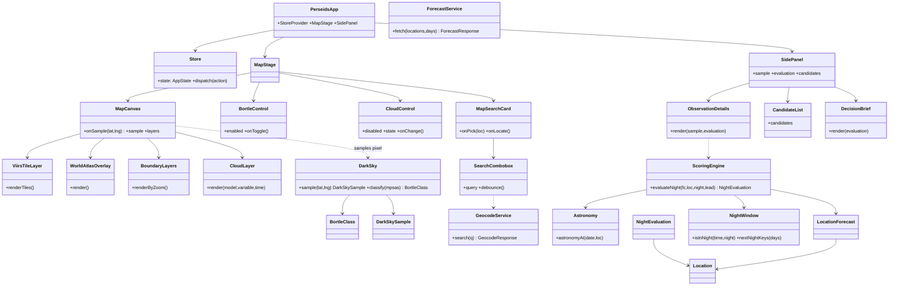
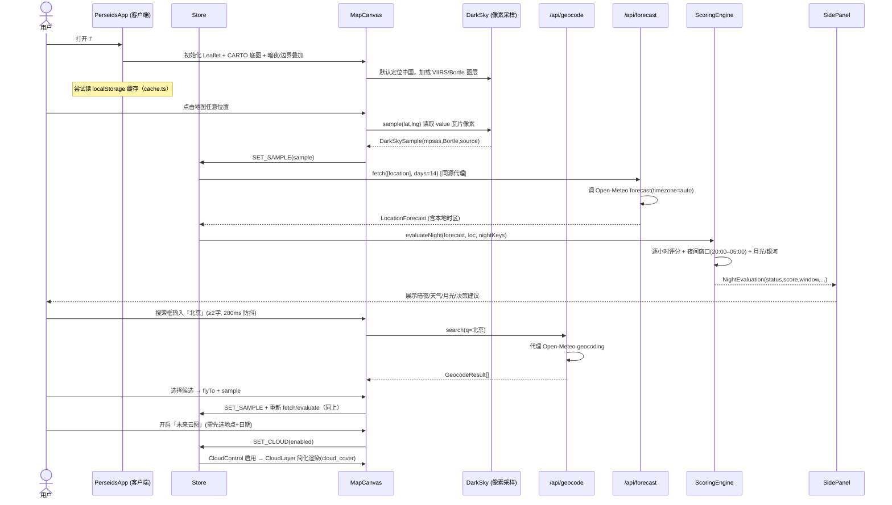

# 系统架构设计 + 任务分解：Next.js 16 克隆 perseids + 全量移植 star-weather

> 作者：架构师（高见远） · 日期：2026-08-07
> 交付对象：实施工程师（直接可动手）
> 范围：把 `star-weather-planner`（Vite 版「星野天气规划器」）重建为 **Next.js 16 克隆版 of `perseids.giraffetree.cn`**（逐星｜全球英仙座流星雨观测地图），并完整移植现有 star-weather 全部功能。

---

## 0. 设计依据（实际读取，非臆造）

本设计全部基于以下已读取的真实文件（非记忆）：

| 文件 | 关键结论 |
|------|----------|
| `docs/research/perseids-recon.md` | perseids DOM 结构、设计 token、Bortle 色带、字体栈、交互、外部 API、7 个不确定项 |
| `public/images/perseids/data/vnp46a4-2024.json` | **Bortle 算法的关键参数已被下载**：`valueEncoding: 1..255 => 14+(value-1)/254*8 magV/arcsec²`；`classification.lowerBoundsMpsas`（8 个阈值）；9 个等级颜色；瓦片配置（minzoom 3 / maxzoom 8 / valueTiles 仅 z=8） |
| `public/images/perseids/data/cities.json` | 370 个中国暗夜候选点（`{id,adcode,province,city,name,longitude,latitude,bortle,kind,note}`）；侧栏「34 个精选」从中派生 |
| `public/images/perseids/data/china-prefecture-boundaries.index.json` | 省级 bbox + 地级市 GeoJSON 分片 URL 索引（WGS84） |
| `public/images/perseids/data/viirs-page.html` | `/viirs#bortle` 参考页原始 HTML（公式/参数/验证方法文案来源） |
| `git show main:src/lib/{openMeteo,scoring,astronomy,cache,clouds,time}.js` | 现有评分/天文/缓存/Open-Meteo/夜间窗口逻辑（**移植源**，不改） |
| `git show main:src/App.jsx`、`git show main:src/data/locations.js` | 现有 star-weather UI 与预置点位（12 个山顶机位） |
| `package.json` / `next.config.ts` / `tsconfig.json` / `components.json` | 模板 = Next 16.2.1 / React 19.2.4 / Tailwind v4 / @base-ui/react / shadcn(base-nova) / lucide；`engines.node>=24`；`output:"standalone"`；`@/* -> ./src/*` |
| `src/app/{page,layout,globals.css}` | 模板当前为占位页，需替换 |

**当前 git 状态**：分支 `feature/nextjs-perseids-clone` @ `7e94868`；Next 模板已铺在根目录（保留 .git）。旧 Vite 源码仍在 `src/App.jsx`、`src/lib/*.js`、`src/data/locations.js` 等，**新代码严禁触碰这些文件**，且新文件命名必须避开与旧 `.js` 同名（见 §3 文件树注释）。

---

## 1. 实现方案概述 + 框架选型

### 1.1 总体架构

- **Next.js 16 App Router**（模板已定）。主地图页 `/` 为客户端组件（`'use client'`），因为 Leaflet、地图交互、像素采样、localStorage 均依赖浏览器 API。
- **服务端代理（Route Handler）**：`/api/forecast` 与 `/api/geocode` 在服务端调用 Open-Meteo，**解决 CORS** 并统一封装（生产目标：同源 `/api/*` 代理）。客户端**只访问本站 API**，绝不直连 Open-Meteo 或腾讯。
- **暗夜/Bortle 估算**：采用**方案 (a) 沿用 perseids 静态瓦片 + 客户端像素采样**（侦察报告中方案二选一的推荐项）。理由：`vnp46a4-2024.json` 已提供 `valueEncoding` 与 `lowerBoundsMpsas`，算法可完整落地；比复用 star-weather 的暗空指数更忠于克隆目标，且无需后端。
- **云图层**：采用**务实简化方案**（见 §1.3），`.cloud-control` 交互完整实现，真实栅格用简化渲染，`.om` 二进制瓦片解析列为最高风险并预留接口。

### 1.2 框架/库选型

| 关注点 | 选型 | 理由 |
|--------|------|------|
| 地图 | `leaflet` + `react-leaflet@^5`（React 19 兼容） | perseids 即 Leaflet；v5 支持 React 19 |
| 底图 | CARTO `dark_all` 瓦片（无 key） | perseids 同款；免费、无需密钥 |
| 天文 | `astronomy-engine`（复用 star-weather） | 太阳/月亮/银河高度、月相 |
| 评分/时间/云层 | 移植 star-weather 的 `scoring/astronomy/time/clouds` → TS | 功能全量移植 |
| 状态 | React Context + `useReducer`（**不新增依赖**） | 避免额外库；见 §3 `store.tsx` |
| UI 基元 | shadcn / @base-ui/react（模板已带） | Popover/Button 等 |
| 图标 | `lucide-react`（模板已带） | 替代 perseids 的 Unicode 字符（保留 `✦ ⌕ ⌾ ☁` 等纯装饰字符亦可） |

### 1.3 暗夜与云图方案取舍（明确结论）

**Bortle（暗空）— 采用静态瓦片 + 客户端像素采样（方案 a）**
- 中国范围（`lat∈[3,55]`, `lng∈[72,136]`）：采样 `vnp46a4/2024-values/{z}/{x}/{y}.webp`（**仅 z=8**）。
  - `value = pixel (0..255)`，0 = nodata；
  - `mpsas = value===0 ? null : 14 + (value-1)/254*8`；
  - `Bortle = classify(mpsas)`，阈值见 §4 `BortleClass`。
  - 视觉层叠加 `vnp46a4/2024/{z}/{x}/{y}.webp`（XYZ TileLayer，z3–8，opacity 0.8）。
- 全球范围（中国以外）：叠加 `world-atlas-2015.webp` 为 `imageOverlay`（single global image，bounds `[-90,90]/[-180,180]`）；像素采样用 `world-atlas-2015-values.webp`，但**其 value 编码未在资产中给出** → 全球采样标记为「近似/不确定」（见 §9 待明确 #2）。
- **完整瓦片集需镜像到本地**（2116 个 value 瓦片 + 2884 个视觉瓦片，约 13.9MB），由 `scripts/fetch-viirs-tiles.mjs` 从 `perseids.giraffetree.cn/data/...` 拉取（静态、无鉴权）。T2 前置。

**未来云图 — 务实简化（Phase 1）**
- `.cloud-control` UI 完整实现：主开关、模型标签（ICON 默认推荐 / GFS / AIFS）、云层类型（总云/低云/中云/高云）、预报时间滑块。
- **开关启用条件**：必须先选地点 + 日期（侦察交互 #7）→ 未满足时 `disabled`（忠实克隆）。
- **渲染（Phase 1）**：用 `/api/forecast` 返回的 `cloud_cover`（及低/中/高云）在选中点渲染**简化云指示**（地图半透明热力标记 + 时间滑块旁当前云量读数）。不解析 `.om` 二进制瓦片。
- **预留接口**：`CloudLayer` 组件抽象出 `render(model, variable, time)`，若后续获得可维护的 `.om` 解码方案（Open-Meteo 官方或 `openmeteo` 包），仅替换该组件内部实现，UI 不变。
- 此为 **#1 风险**（见 §10）。

---

## 2. 路由与页面地图（`src/app`）

| 路由 | 类型 | 客户端？ | 职责 / 数据来源 |
|------|------|----------|----------------|
| `/` | `page.tsx` → `PerseidsApp` | 是（`'use client'`） | 主地图 SPA 外壳：TopBar + MapStage + SidePanel |
| `/viirs` | `page.tsx` | 是 | 「公开公式、参数与验证方法」参考页（由 `viirs-page.html` 文案 + `vnp46a4-2024.json` 参数渲染）；`#bortle` 锚点同页定位。做**真实路由**（优于 SPA fallback） |
| `/api/forecast` | `route.ts`（GET） | 否（server） | 代理 `api.open-meteo.com/v1/forecast`；入参 `latitude,longitude`（逗号列表）、`days`(1–16)；归一化为 `LocationForecast[]`；`timezone=auto` |
| `/api/geocode` | `route.ts`（GET） | 否（server） | 代理 `geocoding-api.open-meteo.com/v1/search`；入参 `q,count,language`；返回 `GeocodeResult[]`。**不**使用腾讯 KEY |

> 布局元数据（`layout.tsx`）：`lang="zh-CN"`、`metadata.title="逐星｜全球英仙座流星雨观测地图"`、`og:image=/images/perseids/og.png`、字体仅用系统 CJK（**不加载 Geist 等 web font**，删掉模板的 `next/font/google` 引入）。

---

## 3. 组件清单与文件树

### 3.1 文件树（新增，全部在 Next 约定目录）

```
src/
  app/
    layout.tsx                 # 根布局：zh-CN + 元数据 + 系统字体 + 暗色 token（改模板）
    page.tsx                   # '/' → 渲染 <PerseidsApp/>（改模板占位）
    globals.css                # 注入 perseids 颜色/字体 token（暗色-only，改模板）
    viirs/page.tsx             # '/viirs' 参考页（公式/参数/验证）
    api/
      forecast/route.ts        # 代理 Open-Meteo forecast
      geocode/route.ts         # 代理 Open-Meteo geocoding
  components/
    PerseidsApp.tsx            # 顶层 client 外壳 + <StoreProvider>
    TopBar.tsx                 # .topbar 品牌 + EventStatus + SourceButton
    EventStatus.tsx            # 倒计时（→2026-08-13T12:00Z，每分钟刷新）
    SourcePopover.tsx          # 「数据依据与局限」浮层
    MapStage.tsx               # .map-stage 容器（编排下列子组件）
    MapCanvas.tsx              # react-leaflet MapContainer（dynamic ssr:false）
    WorldAtlasOverlay.tsx      # 全球 world-atlas-2015.webp imageOverlay
    ViirsTileLayer.tsx         # 中国 vnp46a4/2024 XYZ 瓦片
    BoundaryLayers.tsx         # 国界/省界/市界 GeoJSON（按 zoom 分级显隐）
    CloudLayer.tsx             # 简化云指示（T6；预留 .om 接口）
    MapHeadline.tsx            # .map-headline（PERSEIDS·2026 / 英仙座流星雨）
    MapViewActions.tsx         # 中国/全球/取样中心 + 边界图例
    MapSetup.tsx               # .map-setup 加载遮罩
    MapSearchCard.tsx          # .map-search-card 搜索行 + 我的位置
    SearchCombobox.tsx         # 防抖建议下拉（调 /api/geocode）
    CloudControl.tsx           # .cloud-control（T6）
    BortleControl.tsx          # .bortle-control 开关 + B1–B9 色带
    BortleHelpPopover.tsx      # 波特尔说明浮层（链 /viirs#bortle）
    MapLegend.tsx              # .map-legend 点击提示
    SidePanel.tsx              # .side-panel + .detail-overlay-host
    ObservationDetails.tsx     # 暗夜/天气/月光/窗口/银河
    CandidateList.tsx          # 34 个精选候选（来自 cities.ts）
    DecisionBrief.tsx          # 「今晚判断依据」决策摘要
    ScoreRing.tsx              # 环形分数
    DetailRestore.tsx          # 展开/收起侧栏按钮
    ui/                        # 必要时封装 shadcn/Base UI（Popover、Button）
  lib/                         # ⚠️ 命名刻意避开旧 Vite 的 openMeteo.js/time.js 等同名文件
    types.ts                   # 全部 TS 接口（= JSON schema 源）
    forecast.ts                # 服务端代理逻辑（fetch+归一化），被 /api/forecast 复用
    geocode.ts                 # 服务端代理逻辑，被 /api/geocode 复用
    scoring.ts                 # 移植 evaluateHour/evaluateNight（★功能移植核心）
    astronomy.ts               # 移植 astronomy-engine 包装
    nighttime.ts               # 移植夜间窗口（本地时区，20:00–05:00）★改名避免冲突
    darksky.ts                 # Bortle：像素→mpsas→等级 + 瓦片数学
    cloudLayers.ts             # 移植 deriveCloudLayers（气压层云推导）
    cache.ts                   # localStorage 预报/点位缓存（移植）
    store.tsx                  # React Context + useReducer 全局状态
    constants.ts               # METEOR_SHOWER 窗口/峰值、NIGHT_START/END、颜色 token
  data/
    viirsMeta.ts               # 从 vnp46a4-2024.json 提取的阈值/颜色常量
    cities.ts                  # 370 全量 + 派生 34 精选（来自 cities.json）
  hooks/
    useGeolocation.ts          # 我的位置
    useCountdown.ts            # 倒计时
  scripts/
    fetch-viirs-tiles.mjs      # 镜像 VIIRS 瓦片集（T2 前置）
public/images/perseids/        # 已下载资产（见 §0）；T2 补充完整瓦片集
```

> **碰撞规避**：旧 Vite 源码在 `src/lib/openMeteo.js`、`src/lib/time.js`、`src/data/locations.js`。新文件分别命名为 `forecast.ts`、`nighttime.ts`、`cities.ts`，**不覆盖**旧文件。

### 3.2 组件职责 / Props 契约 / 状态（节选关键组件）

| 组件 | 职责 | 关键 props | 用到的 UI 基元 / 状态 |
|------|------|-----------|----------------------|
| `PerseidsApp` | 组装外壳、提供 store、挂载地图与侧栏 | — | `StoreProvider` |
| `TopBar` | 品牌「逐星」、事件倒计时、数据来源入口 | `peakTimeISO`, `onOpenSource` | `EventStatus`, `SourcePopover` |
| `MapCanvas` | Leaflet 容器；底图 + 各叠加层 + 取样标记 | `center`, `onSample(lat,lng)`, `sample`, `layers` | react-leaflet `MapContainer/TileLayer/ImageOverlay/Marker/CircleMarker/GeoJSON`；`dynamic(ssr:false)` |
| `MapSearchCard` | 搜索框 + 我的位置 | `onPick(location)`, `onLocate` | `SearchCombobox`, `useGeolocation` |
| `CloudControl` | 云图主开关/模型/类型/时间 | `disabled`(需地点+日期), `state`, `onChange` | Base UI `Tabs`/`Slider` |
| `BortleControl` | 暗空图层开关 + B1–9 色带 + 帮助 | `enabled`, `onToggle` | `BortleHelpPopover` |
| `SidePanel` | 观测详情抽屉 + 候选列表 + 展开按钮 | `sample`, `evaluation`, `candidates` | `ObservationDetails`, `CandidateList`, `DecisionBrief`, `DetailRestore` |
| `ObservationDetails` | 展示暗夜(mpsas/Bortle)、天气窗口、月光、银河最高、置信度 | `sample:DarkSkySample`, `evaluation:NightEvaluation` | `ScoreRing` |

**全局状态（`store.tsx`）字段**：`sample`（当前取样点 + DarkSkySample）、`selectedLocation?`、`forecast?`（`LocationForecast[]`）、`nightKeys`（11 晚）、`selectedNight`、`bortleEnabled`、`cloudState`（{enabled,model,variable,timeIndex}）、`candidates`、`detailOpen`、`loading/error`。Actions：`SET_SAMPLE`、`SET_FORECAST`、`SELECT_NIGHT`、`TOGGLE_BORTLE`、`SET_CLOUD` 等。

---

## 4. 数据结构与接口（TS 接口 = JSON schema 源）

### 4.1 共享类型（`src/lib/types.ts`）

```ts
// —— 地点 ——
interface Location {
  id: string;                 // "custom-<ts>" | "preset-<id>" | "city-<adcode>"
  name: string;
  latitude: number;
  longitude: number;
  elevation: number;          // 米，用户海拔不被模型静默覆盖
  timezone?: string;          // IANA，由 /api/forecast 回填（timezone=auto）
  source: "参考点位" | "自定义" | "modeled" | "搜索";
  bortle?: number;            // 可选预估值（cities.json 已有）
}

// —— 暗夜采样（Bortle）——
interface DarkSkySample {
  latitude: number;
  longitude: number;
  mpsas: number | null;       // 14..22；null=nodata/未知
  bortle: number;             // 1..9（mpsas 为 null 时回退为 9 并标 uncertain）
  bortleName: string;         // "极佳暗空" ...
  source: "viirs-2024" | "world-atlas-2015" | "none";
  uncertain?: boolean;        // 全球非中国采样为 true
}

// —— Bortle 等级（来自 vnp46a4-2024.json）——
interface BortleClass {
  level: number;              // 1..9
  name: string;               // 中文名
  color: string;              // 色带 hex
  lowerBoundMpsas: number;    // 该级下限（B1=21.99 … B8=17.80；B9 无下限）
}
// 阈值（降序）：[21.99,21.89,21.69,20.49,19.5,18.94,18.38,17.80]
// 分类：mpsas>=bound[i] → 等级 i+1；全不满足 → B9

// —— 天气小时（归一化，移植自 openMeteo.normalizeHourly）——
interface HourWeather {
  time: string;               // "YYYY-MM-DDTHH:mm"（地点本地时区）
  temperature?: number; humidity?: number; dewPoint?: number;
  precipitationProbability?: number; precipitation?: number;
  weatherCode?: number; cloudCover?: number;
  cloudLow?: number; cloudMid?: number; cloudHigh?: number;
  visibility?: number; windSpeed?: number; windGust?: number;
}

// —— /api/forecast 响应 ——
interface LocationForecast {
  locationId: string;
  modelLatitude: number; modelLongitude: number; modelElevation: number;
  timezone: string; utcOffsetSeconds: number;
  fetchedAt: string;          // ISO
  hourly: HourWeather[];
}
interface ForecastResponse { locations: LocationForecast[]; }

// —— /api/geocode 响应 ——
interface GeocodeResult {
  id: number; name: string; latitude: number; longitude: number;
  elevation?: number; country?: string; admin1?: string;
  timezone?: string; featureCode?: string;
}
interface GeocodeResponse { results: GeocodeResult[]; }

// —— 评分（移植自 scoring.evaluateHour / evaluateNight）——
interface HourEvaluation extends HourWeather {
  sunAltitude: number; moonAltitude: number; moonIllumination: number;
  galacticAltitude: number;
  score: number; quality: "excellent"|"candidate"|"poor"|"blocked";
  blockers: string[];
  components: { clearSky:number; precipitation:number; transparency:number; wind:number; darkness:number; moonlight:number };
}
interface NightEvaluation {
  nightKey: string;           // "YYYY-MM-DD"（当地日期）
  score: number; cloudSeaPotential: number;
  status: "go"|"watch"|"no"|"trend";
  confidence: { level:string; kind:"high"|"medium"|"low"|"trend"; reason:string };
  hours: HourEvaluation[]; window: HourEvaluation[];
  windowLabel: string; darkHours: number; galacticMax: number;
  moonIllumination: number; moonPhase: string; blockers: string[];
  reason: string; scoreModelVersion: string;
}
```

### 4.2 `/api/forecast` 请求/响应契约

- **请求**：`GET /api/forecast?latitude=30.02,40.18&longitude=119.0,116.4&days=14`
  - `latitude`/`longitude`：逗号分隔的多地点列表（支持批量，移植 `fetchSurfaceForecasts` 的多点能力）。
  - `days`：1–16（默认 14）。
- **响应** `200`：`ForecastResponse`（见上）。服务端已注入 `hourly` 全部变量、`timezone=auto`、`forecast_days=days`、`wind_speed_unit=ms`。
- **错误**：上游非 2xx → `502 {error}`；参数缺失 → `400`。

### 4.3 `/api/geocode` 请求/响应契约

- **请求**：`GET /api/geocode?q=北京&count=10&language=zh`
- **响应** `200`：`GeocodeResponse`（`results` 取自 Open-Meteo `results`，裁剪字段）。
- **说明**：仅 Open-Meteo（全球，无需 key）。**不**接入腾讯；中文 POI 丰富度下降（见 §9 #3）。

### 4.4 类图（Mermaid）



---

## 5. 程序调用流程（时序图，Mermaid）



---

## 6. 任务列表（有序、含依赖、按实现顺序）

> 命名遵循 team-lead 约定（T1..T8）。每个任务含：**依赖 / 涉及文件 / 验收点**。所有任务在 Node 24（`C:\Program Files\nodejs\node.exe`）下执行 `npm install` 与 `npm run check`。新代码均在 `src/app`、`src/components`、`src/lib`、`src/data` 下，**不改动旧 Vite 文件**。

### T1 — 项目基础设施 + 服务端天气/地理代理
- **依赖**：无（前置：Node 24 就绪）
- **涉及文件**：
  - `package.json`（新增 `leaflet`、`react-leaflet@^5`、`astronomy-engine`、`@types/leaflet`(dev)）
  - `src/app/api/forecast/route.ts`、`src/app/api/geocode/route.ts`
  - `src/lib/forecast.ts`、`src/lib/geocode.ts`、`src/lib/types.ts`
  - `src/app/layout.tsx`（zh-CN、元数据、og:image、删 Geist web font）、`src/app/globals.css`（注入 §8 token）、`src/app/page.tsx`（渲染 `<PerseidsApp/>`）
- **验收点**：
  1. `curl '/api/forecast?latitude=30.02&longitude=119.0&days=3'` 返回 `ForecastResponse`（`hourly` 含 13 个变量、`timezone`、`utcOffsetSeconds`）。
  2. `curl '/api/geocode?q=%E5%8C%97%E4%BA%AC&count=5'` 返回 `GeocodeResponse`。
  3. 代码中**无任何腾讯 KEY / 直连 Open-Meteo 域名**；`npm run typecheck` 通过。

### T2 — 地图基底 + 暗夜(Bortle)图层 + 边界
- **依赖**：T1（types、deps、`/api/*` 约定）
- **前置**：运行 `scripts/fetch-viirs-tiles.mjs` 镜像完整 VIIRS 瓦片集到 `public/images/perseids/data/vnp46a4/`。
- **涉及文件**：
  - `src/components/MapStage.tsx`、`MapCanvas.tsx`、`WorldAtlasOverlay.tsx`、`ViirsTileLayer.tsx`、`BoundaryLayers.tsx`、`MapHeadline.tsx`、`MapViewActions.tsx`、`MapSetup.tsx`、`MapLegend.tsx`
  - `src/lib/darksky.ts`（像素→mpsas→等级 + Web Mercator 瓦片数学）
  - `src/data/viirsMeta.ts`（阈值/颜色常量）
  - `src/lib/store.tsx`（新增 `sample`/`bortleEnabled` 等 state）
- **验收点**：
  1. 首屏地图以中国为中心，CARTO 暗色底图 + 全球 WorldAtlas overlay + 中国 VIIRS 瓦片可见。
  2. 点击地图（中国境内）→ `DarkSkySample` 计算正确（对照 `vnp46a4-samples-2024.json` 同坐标已知 Bortle，误差 ≤1 级）。
  3. 国界/省界(z4+)/市界(z6+) 按 zoom 分级显隐；边界仅作参考。
  4. BortleControl 开关切换图层显隐。

### T3 — 地点搜索 + 我的位置 + 候选列表
- **依赖**：T1（`/api/geocode`）
- **涉及文件**：
  - `src/components/MapSearchCard.tsx`、`SearchCombobox.tsx`
  - `src/hooks/useGeolocation.ts`
  - `src/data/cities.ts`（370 全量 + 派生 34 精选）
  - `src/components/SidePanel.tsx`、`CandidateList.tsx`、`DetailRestore.tsx`
- **验收点**：
  1. 输入 ≥2 字符、280ms 防抖 → 下拉显示 `/api/geocode` 建议；选中 `flyTo` + 触发采样。
  2. 「我的位置」调用 `navigator.geolocation` 成功后在坐标创建取样点。
  3. 侧栏展示 34 个精选候选（名称/省份/海拔），点击选中并定位。

### T4 — 评分引擎移植（全量功能核心）
- **依赖**：T1（types）
- **涉及文件**：
  - `src/lib/scoring.ts`（移植 `evaluateHour`/`evaluateNight`/`statusMeta`）
  - `src/lib/astronomy.ts`（移植 `astronomyAt`/`moonPhaseName`）
  - `src/lib/nighttime.ts`（移植 `isInNight`/`nextNightKeys`/`formatHour` 等，**改用地点本地时区，夜间窗口 20:00–05:00**）
  - `src/lib/cloudLayers.ts`（移植 `deriveCloudLayers`）
  - `src/lib/cache.ts`（移植 localStorage 缓存）
- **验收点**：
  1. 对已知地点+夜，`evaluateNight` 返回 `NightEvaluation`（status/go-watch-no-trend、score、windowLabel、moonPhase、blockers）。
  2. 夜间窗口严格为 **20:00–次日 05:00 当地时区**（非旧版 18:00–06:00）。
  3. 时间与天文计算使用的时区来自 `/api/forecast` 返回的 `timezone`（全球地点正确）。
  4. `SCORE_MODEL_VERSION` 保留（`star-v1.0`）。

### T5 — 观测详情侧栏 + 决策窗口
- **依赖**：T2（sample）、T4（evaluation）
- **涉及文件**：
  - `src/components/SidePanel.tsx`、`ObservationDetails.tsx`、`DecisionBrief.tsx`、`ScoreRing.tsx`
  - `src/components/TopBar.tsx`、`EventStatus.tsx`、`SourcePopover.tsx`、`BortleHelpPopover.tsx`
- **验收点**：
  1. 选中点后侧栏展示：暗夜(mpsas/Bortle)、最佳连续窗口、月面照度、暗夜时长、银河最高、置信度、决策建议文案。
  2. 「今晚判断依据」三要素（连续窗口/天气门禁/置信度）渲染。
  3. TopBar 倒计时至 `2026-08-13T12:00:00Z`，每分钟刷新；「数据依据与局限」浮层可开。
  4. Bortle 帮助浮层链 `/viirs#bortle`。

### T6 — 未来云图层 + 交互状态
- **依赖**：T2（地图）、T4（cloud 变量）
- **涉及文件**：
  - `src/components/CloudControl.tsx`、`CloudLayer.tsx`
  - `src/lib/store.tsx`（新增 `cloudState`）
- **验收点**：
  1. 未选地点+日期时云图主开关 `disabled`（忠实克隆交互 #7）。
  2. 启用后：模型标签(ICON/GFS/AIFS)、云层类型(总/低/中/高)、时间滑块**可交互**；简化云指示在地图与滑块旁渲染（数据源 `/api/forecast` 的 `cloud_cover` 等）。
  3. `CloudLayer.render(model,variable,time)` 接口预留，便于后续替换 `.om` 解码实现而不动 UI。

### T7 — 响应式/移动端 + `/viirs` 参考页
- **依赖**：T5
- **涉及文件**：
  - `src/app/viirs/page.tsx`（由 `viirs-page.html` 文案 + `vnp46a4-2024.json` 参数渲染公式/验证）
  - `globals.css`（移动端断点：地图全屏 + 侧栏改为底部抽屉 `detail-overlay-host` 行为）
  - `src/components/DetailRestore.tsx`（移动端展开/收起）
- **验收点**：
  1. 移动端（≤768px）：地图占满，侧栏为底部抽屉，搜索/控制可触达；对照 `docs/design-references/perseids-mobile.png`。
  2. `/viirs` 渲染 Bortle 公式（`formula`/`coefficients`/`lowerBoundsMpsas`）、校准说明、验证方法与科学边界（来自 JSON + HTML 文案）。

### T8 — 主题精修 + localStorage 缓存 + 生产校验
- **依赖**：T2、T4、T5
- **涉及文件**：
  - `src/lib/cache.ts`（接 T4，key 改名 `perseids-forecast-v1`、1h 过期）
  - `globals.css`（玻璃拟态面板、阴影/光效、字体栈最终对齐 §8）
  - `src/app/layout.tsx`（最终 metadata/OG）
  - `Dockerfile`（`output:standalone` 已配，确认容器可构建运行）
- **验收点**：
  1. 预报缓存 1h；刷新优先读缓存、过期/失败保留上次成功数据（移植 `cache.js` 行为）。
  2. 视觉逐像素对齐 perseids token（背景 `#02070b`、文字 `#e7e7e0`、amber `#d4b273`、green `#79cfe2`、B1–B9 色带）。
  3. `npm run check`（lint+typecheck+build）全绿；`docker build` 成功产出 standalone 镜像。

---

## 7. 依赖包列表（模板之外新增）

| 包 | 版本 | 用途 | 类型 |
|----|------|------|------|
| `leaflet` | `^1.9.4` | 地图核心（需 `leaflet/dist/leaflet.css`） | 依赖 |
| `react-leaflet` | `^5.0.0` | React 19 兼容的 Leaflet 绑定（MapContainer/TileLayer/GeoJSON/Marker） | 依赖 |
| `astronomy-engine` | `^2.1.19` | 太阳/月亮/银河高度、月相（复用 star-weather） | 依赖 |
| `@types/leaflet` | `^1.9.12` | Leaflet 类型 | dev |
| （可选）`zustand` | `^5` | 若 Context 状态过于臃肿可替换 `store.tsx`；**v1 用 Context，不强制** | 依赖（可选） |

> **明确不引入**：腾讯地图 SDK / KEY；`.om` 解析专用库（Phase 1 不做）；ECharts（perseids 无逐小时图表，侧栏用轻量展示，不移植 star-weather 的 ReactECharts）。

---

## 8. 共享知识（跨文件约定）

- **颜色 token**（`globals.css :root`，暗色-only，无亮色模式）：
  `--bg:#02070b; --text:#e7e7e0; --muted:#91a4ab; --amber:#d4b273; --green:#79cfe2; --green-soft:#b0e6ef; --red:#cb7768; --panel:#061118d1; --panel-2:#0c1e27b8; --line:#a5cdd829; --line-strong:#97d3e152;`
  在 Tailwind v4 `@theme` 中以 `--color-bg` 等映射，供 `bg-bg`/`text-text` 使用。
- **Bortle 色带**：`viirsMeta.ts` 导出 `BORTLE_CLASSES: BortleClass[]`（9 级，颜色同 recon §3.2）。
- **字体栈**（无 web font，系统 CJK）：
  - UI/正文：`"PingFang SC","Microsoft YaHei","Noto Sans CJK SC",system-ui,sans-serif`
  - 标题/品牌（宋体）：`"Songti SC",STSong,"Noto Serif CJK SC",Georgia,serif`
  - 代码/数据：`ui-monospace,SFMono-Regular,Menlo,Monaco,Consolas,monospace`
  `layout.tsx` 用 `next/font` 仅作 fallback 或不引入；CSS 直接写字体栈。
- **暗夜像素→mpsas 编码**（中国，z=8 value 瓦片）：`mpsas = v===0 ? null : 14 + (v-1)/254*8`；`v∈[1,255]` 对应 `mpsas∈[14,22]`。
- **Bortle 分类**：阈值降序 `[21.99,21.89,21.69,20.49,19.5,18.94,18.38,17.80]`；`mpsas>=bound[i]→等级 i+1`；全不满足→B9。`mpsas===null`（nodata/全球未知）→B9 且 `uncertain:true`。
- **日期/时区**：
  - 所有天气时间字符串为**地点本地时区** `"YYYY-MM-DDTHH:mm"`（来自 `timezone=auto`）。
  - 夜间窗口：**20:00–次日 05:00 当地时区**（常量 `NIGHT_START=20, NIGHT_END=5`，见 `constants.ts`）。
  - 流星雨窗口：硬编码 `2026-08-07`…`2026-08-17`（11 晚）；峰值倒计时目标 `2026-08-13T12:00:00Z`（常量 `METEOR_PEAK_ISO`）。
  - 时区转换一律用 `Intl.DateTimeFormat`（不自带 tz 数据库）。
- **缓存 key 规则**（`cache.ts`）：`perseids-forecast-v1`（预报，1h 过期）、`perseids-locations-v1`（自定义点位）。**不使用**旧 `star-weather-*` key。

---

## 9. 待明确事项（给 PM/用户澄清清单）

### 侦察报告原有 7 项（更新状态）
1. **云层 `.om` 协议** — **仍为 #1 风险**。Phase 1 用简化云（§1.3），真实栅格待解码方案。需 PM 确认「简化云」是否可接受为 v1 交付。
2. **Bortle 像素采样算法** — **已大幅收敛**：`vnp46a4-2024.json` 已给出 `valueEncoding` 与 `lowerBoundsMpsas`，算法可落地（§4/§8）。**残留**：全球（非中国）`world-atlas-2015-values.webp` 的 value 编码未知 → 全球采样标记为近似/不确定。
3. **腾讯 API KEY 暴露** — 决策：**弃用腾讯**，仅 Open-Meteo geocoding（无 key）。代价：中文 POI/地标丰富度下降。需 PM 确认是否后续接入合规的中文地理编码服务。
4. **地图性能** — 边界 GeoJSON(200–400KB+)+WorldAtlas 首屏较重。缓解：边界分片懒加载（prefecture index 已就绪）、WorldAtlas 用单图 overlay、加载遮罩（`.map-setup`）。无需澄清，已纳入设计。
5. **路由 `/viirs`** — 决策：做**真实 Next.js 路由**（非 SPA fallback），渲染参考内容。无需澄清。
6. **WebP tiles 路径参数** — 瓦片 style 可能随目标站更新（`garstang-cinzano-zsb-2024-v2.0&soft-bands-no-outline-v2`）。镜像时锁定当前版本；若目标站改版需重新镜像。无需澄清，已知风险。
7. **未来云图启用条件** — 已纳入：需先选地点+日期才启用（§6 T6）。无需澄清。

### 新发现（本次设计新增）
8. **夜间窗口口径冲突** — star-weather 用 18:00–06:00，perseids 用 **20:00–05:00**。→ 采用 20:00–05:00 以忠实克隆；建议 PM 确认。
9. **VIIRS 完整瓦片集需镜像** — `valueTiles` 仅 z=8（2116 片）+ 视觉瓦片 2884 片（约 13.9MB）。需确认：(a) 是否允许把这些静态瓦片纳入仓库/构建；(b) 构建机是否有网络拉取（提供 `scripts/fetch-viirs-tiles.mjs`）。
10. **侧栏「34 个精选」派生规则** — `cities.json` 有 370 条；perseids 侧栏展示 34 个（如 汤河口镇、黄崖关长城北部…）。需确认 34 的筛选规则（按 Bortle 最低？海拔？省份覆盖？），或许可直接 port `vnp46a4-samples-2024.json` 中已排序的精选集。
11. **全球采样 value 编码** — 见 #2；若要对全球（非中国）也给出可信 Bortle，需补充 WorldAtlas values 文件编码或改用近似模型。
12. **流星雨窗口是否硬编码 2026** — 当前按 2026 英仙座硬编码（忠实克隆）。若希望做成「通用流星雨规划器」需改为动态计算峰值（Jenniskens 活动曲线）；建议 v1 保持 2026 硬编码 + `constants.ts` 常量，便于后续参数化。

---

## 10. 关键决策与三大风险（摘要）

**关键决策**
- 暗夜采用 perseids 静态瓦片 + 客户端像素采样（算法已由 `vnp46a4-2024.json` 闭合），不依赖后端、最忠于克隆。
- 天气/地理统一走同源 `/api/*` Route Handler 代理，彻底移除腾讯 KEY 与 CORS 问题。
- 全量移植 star-weather 的评分/天文/夜间窗口/云层推导逻辑（TS 重写，时区改为按地点本地）。
- 状态用 React Context（零新增依赖）；地图用 `react-leaflet@5`（React 19 兼容）+ CARTO 无 key 底图。

**三大最高风险**
1. **未来云图 `.om` 二进制瓦片解析**（侦察 #1）：Open-Meteo 云瓦片为自定义二进制格式，无现成轻量解码器。缓解：`CloudControl` UI 与交互 100% 实现，Phase 1 用 `/api/forecast` 的 `cloud_cover` 做简化云指示，`CloudLayer` 预留替换接口。
2. **全球（非中国）Bortle 采样不确定**（侦察 #2 残留）：中国范围内算法闭合；中国以外 `world-atlas-2015-values.webp` 编码未知，只能给近似/标记 uncertain 的结果。
3. **Vite/Next 旧源码共存与构建隔离**：旧 `src/*.js` 仍在仓库，可能与新 TS 混淆或被误改。缓解：新文件统一命名避开旧同名（§3 注释），新代码仅放 `src/app|components|lib|data`，绝不 import 旧 Vite 模块；`npm run check` 作为合并门禁。
