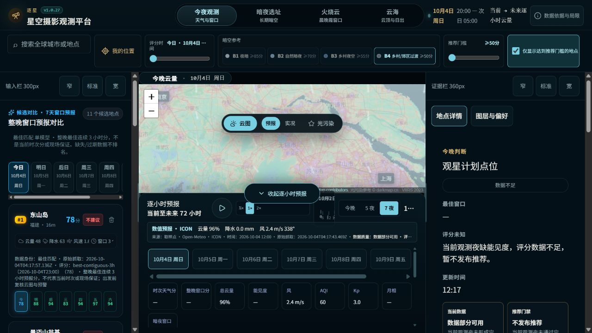

# 候选天气临时失败后的有界恢复

## 历史处理经验
2026-10-01-weather-header-repair.md 已记录429每日额度、持久化冷却、原始抓取时间、六小时保留上限与低内存部署；2026-10-02-branch-consolidation.md 明确单点200不证明整批候选表恢复。知识库检索也存在这些经验。本轮上一交付缺少实际整批页面验收，不能据单点评分声称整个页面恢复。

## 本轮证据与缺陷
2026-10-04线上v1.0.26，无供应商冷却标记；从目录选取大明山/美坑/铁山寺三点的普通批量请求200。实际生产页面12地点84评分单元，BestMatch源时间2026-10-04T03:12:33.069Z，候选请求错误为空。截图最初失败的具体上游原因未从当前日志恢复，不能断言是429。
useCandidateForecasts 只监听坐标、模型、手动刷新revision。初始请求失败后没有定时恢复，即便60秒浏览器冷却结束，原页面仍可能一直空。新增一次普通重试：等待客户端和供应商最长冷却+1秒，不强制刷新；第二次失败停止重试；卸载取消定时器；各批成功后清除本批失败提示。保留模型、时间与评分门禁。

## 当前验证
本地完整lint/typecheck72文件418测试/buildPASS。桌面/手机模拟首次503后冷却期间无重试、冷却结束恢复评分2PASS；客户端长供应商冷却验证3PASS。PR50原始CI生产依赖审计失败，shadcn生成CLI归入开发依赖并保留4.16.2，生产audit0；开发依赖漏洞不冒称已消失。新head0efe0a8完整CI待终态，合并部署与最终生产页验收仍PENDING。
远端旧聊天满额，PENDING_REMOTE_PLANNING保持，不声称远端已审核。

## 批量缓存持久化补丁
验收发现较大批次没有持久化文件：文件名直接Base64编码全部坐标，临时文件后缀使长度进一步增长，超过系统单文件名上限而写入被忽略。新增64地点进程重启回归：原代码0文件RED；固定SHA256文件名后23缓存测试及完整72文件420测试/buildPASS。保留旧短文件名兼容读取、原始抓取时间和6小时上限，不清空缓存。PR51 head4e867ec，最终发布回执待补。

## 2026-10-04 Final candidate recovery and batch persistence receipt
- Root cause confirmed: failed candidate hook did not recover after cooldown; large coordinate-derived filenames silently failed persistence. The original screenshot request's first network failure reason was not recovered from logs, so it is not labelled a proven429.
- PR50 head d6785fd426eaffb8f98362325f33dfc390301b05 /CI37174401726 all5SUCCESS, Chromium230PASS122SKIP0FAIL. PR51 head4e867ecf2aa03e945de535ddb3e6066e8f3ae898 /CI37175774737 terminalSUCCESS. PR51 merged ee7269f7964603b342411354d0f36ee100654d70; source/scripts/package byte-equal to tested runtimehead4e867ec.
- v1.0.27 runtime4e867ecf2aa03e945de535ddb3e6066e8f3ae898 deployed; image star-photo-addr:deploy-4e867ecf2aa0. App/worker healthy, rollback-before-4e867ecf2aa0 and original star-photo_observing-snapshots volume retained. Original directory main synchronized and matching dependencies installed.
- Local fullcheck72files420tests/lint/typecheck/buildPASS; cache route/integrity23PASS including1/64locations after module restart. Client recovery desktop/mobile2PASS and manual-revision normal retry unitPASS. Source/model/age gates retained.
- Actual production page12rows84numeric score cells,no candidate request errors; BestMatch source2026-10-04T04:17:57.136Z.17-location batch persisted in69-character hash filename,source2026-10-04T04:17:56.820Z,allFresh=true.
- Isolated cold container with network=none,memory192MB,originalvolume read-only: HTTP200,X-Forecast-Cache=cache-only-disk,X-Data-Stale=false,count17,original source2026-10-04T04:17:56.820Z. No provider access. Probe container removed; volume retained.
- Prior guidance exists in2026-10-01-weather-header-repair.md and2026-10-02-branch-consolidation.md; knowledge search found prior429/cooldown cases. Previous single-point-only acceptance did not close whole-page recovery. New regression and receipt correct that gap.
- PENDING_REMOTE_PLANNING preserved: old remote chat full,successor decision pending; no remote finalDONE claimed. ICON missing-visibility and unlicensed dark-sky fields remain explicit missing-data gates, not filled from another model.

